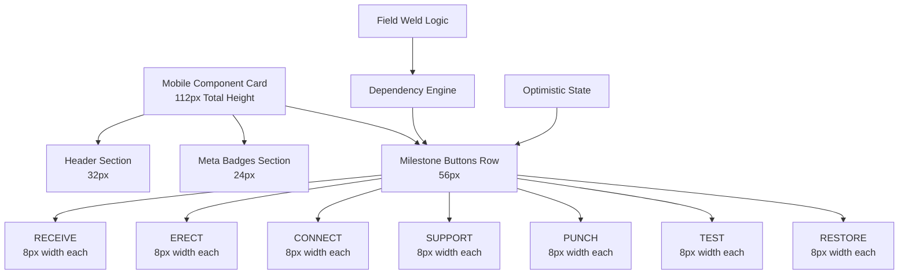

# PipeTrak Mobile Milestone UI Redesign - Technical Architecture

**Document Version:** 1.0  
**Date:** January 11, 2025  
**Architecture Phase:** System Architect (Phase 2 of 6)  
**Target:** Mobile milestone interface transformation for field operations

## Executive Summary

This document defines the comprehensive technical architecture for transforming PipeTrak's mobile milestone interface from swipe-based interactions to direct-tap milestone buttons. The redesign prioritizes field usability for construction workers operating in harsh conditions with gloves, providing obvious and reliable interactions that work consistently on mobile devices.

The architecture leverages existing Supabase-native infrastructure while introducing new component hierarchies, state management patterns, and performance optimizations specifically designed for high-volume field operations.

:::brainstorm
**System & Infrastructure Analysis:**

Bounded Contexts Identified:
- Mobile UI Layer: Direct milestone button interactions, 112px component cards, touch-optimized interface
- Milestone Dependencies: Sequential logic with flexible middle phases (RECEIVE → ERECT/CONNECT/SUPPORT → PUNCH → TEST → RESTORE)
- Field Weld Special Cases: Enhanced sequence with welder assignment and x-ray integration
- State Management: Optimistic updates, offline queuing, conflict resolution
- Performance Layer: Virtual scrolling, batched operations, memory optimization for 200+ components

Scale Targets Confirmed:
- 200+ components per drawing with real-time updates
- 7 milestone buttons per component (56px height row)
- 60fps scrolling performance requirement
- <50ms touch response for field operations
- Offline-first capability with sync queue

Data Architecture Requirements:
- Existing ComponentMilestone schema supports all workflow types
- Field weld dependencies require special sequencing logic
- Component instance tracking already implemented
- ROC weight calculations maintain existing patterns
- Audit trail preservation through existing infrastructure

API & Integration Strategy:
- Leverage existing `/api/pipetrak/milestones/*` endpoints
- Extend bulk update API for performance optimization
- Maintain PostgREST compatibility for table views
- Supabase Realtime for live updates
- Edge Functions for complex dependency calculations

Security & Performance Considerations:
- Row Level Security already implemented for organization scoping
- Optimistic updates require rollback mechanisms
- Batched operations to prevent API overload
- Memory-efficient virtual scrolling for large datasets
- Touch target accessibility (minimum 44px, recommended 52px)

Risk Assessment:
- Component card layout constraints (112px total height)
- Milestone dependency complexity in mobile interface
- Performance degradation with large component lists
- Touch interaction reliability in field conditions
- State synchronization across multiple concurrent users
:::

## System Overview

### Current Foundation (Existing)
- **Database Schema**: Complete ComponentMilestone system with workflow types
- **API Infrastructure**: Robust milestone API with bulk operations
- **Authentication**: Supabase Auth with organization-scoped RLS
- **Real-time Sync**: WebSocket-based live updates
- **Mobile Components**: TouchMilestoneCard, SwipeActions, MobileMilestoneSheet

### Mobile Redesign Transformation



## Component Architecture Redesign

### 1. New Component Hierarchy

```typescript
apps/web/modules/pipetrak/components/milestones/mobile/
├── redesign/
│   ├── MobileComponentCard.tsx           # NEW: 3-section layout (112px)
│   ├── MilestoneButtonRow.tsx           # NEW: 7 equal-width buttons
│   ├── MilestoneButton.tsx              # NEW: Individual milestone button
│   ├── DependencyEngine.tsx             # NEW: Milestone dependency logic
│   ├── FieldWeldSequence.tsx            # NEW: Special field weld handling
│   └── CompactProgressIndicator.tsx     # NEW: Minimal progress display
├── core/
│   ├── OptimisticStateManager.tsx       # ENHANCED: Mobile-first optimizations
│   ├── TouchInteractionEngine.tsx       # NEW: Touch event coordination
│   └── PerformanceManager.tsx           # NEW: Virtual scrolling and batching
├── legacy/ (to be removed)
│   ├── MobileMilestoneSheet.tsx         # REMOVE: Bottom sheet approach
│   ├── SwipeActions.tsx                 # REMOVE: Swipe gesture handlers
│   └── TouchMilestoneCard.tsx           # REPLACE: With MobileComponentCard
```

### 2. MobileComponentCard - Core Interface

```typescript
interface MobileComponentCardProps {
  component: ComponentWithMilestones;
  isSelected?: boolean;
  onMilestoneUpdate: (milestoneId: string, value: boolean | number) => Promise<void>;
  onComponentSelect?: (componentId: string) => void;
  virtualItemProps?: VirtualItem; // For virtual scrolling
}

interface CardLayout {
  totalHeight: 112; // Fixed height for virtual scrolling
  sections: {
    header: 32;    // Component ID, type, basic info
    meta: 24;      // Area, system, progress badges
    milestones: 56; // 7 milestone buttons (8px each)
  };
  touchTargets: {
    minimum: 44;     // iOS HIG compliance
    recommended: 52; // Glove-friendly
  };
}

function MobileComponentCard({ component, onMilestoneUpdate, ...props }: MobileComponentCardProps) {
  const { milestones, dependencies } = useMilestoneDependencies(component);
  const { updateMilestone, isPending } = useOptimisticUpdates();
  
  return (
    <Card className="h-[112px] w-full border rounded-lg">
      {/* Header Section - 32px */}
      <CardHeader className="h-8 p-2 pb-1">
        <div className="flex items-center justify-between">
          <h4 className="font-medium text-sm truncate">{component.componentId}</h4>
          <Badge variant="secondary" className="text-xs">{component.type}</Badge>
        </div>
      </CardHeader>
      
      {/* Meta Section - 24px */}
      <div className="h-6 px-2 pb-1">
        <div className="flex items-center gap-1 text-xs text-muted-foreground">
          <span>{component.area}</span>
          <span>•</span>
          <span>{component.system}</span>
          <CompactProgressIndicator progress={calculateProgress(component)} />
        </div>
      </div>
      
      {/* Milestone Buttons Row - 56px */}
      <div className="h-14 p-2">
        <MilestoneButtonRow
          milestones={milestones}
          dependencies={dependencies}
          onUpdate={onMilestoneUpdate}
          isPending={isPending}
        />
      </div>
    </Card>
  );
}
```

### 3. MilestoneButtonRow - 7-Button Layout

```typescript
interface MilestoneButtonRowProps {
  milestones: ComponentMilestone[];
  dependencies: MilestoneDependencies;
  onUpdate: (milestoneId: string, value: boolean | number) => Promise<void>;
  isPending: (milestoneId: string) => boolean;
}

function MilestoneButtonRow({ milestones, dependencies, onUpdate, isPending }: MilestoneButtonRowProps) {
  const buttonWidth = `calc(100% / 7)`; // Equal width distribution
  
  return (
    <div className="flex gap-1 h-full">
      {MILESTONE_ORDER.map((milestoneName, index) => {
        const milestone = milestones.find(m => m.milestoneName === milestoneName);
        const isEnabled = dependencies.isEnabled(milestoneName);
        const isCompleted = milestone?.isCompleted || false;
        
        return (
          <MilestoneButton
            key={milestoneName}
            milestone={milestone}
            name={milestoneName}
            isEnabled={isEnabled}
            isCompleted={isCompleted}
            isPending={isPending(milestone?.id || '')}
            width={buttonWidth}
            onUpdate={(value) => onUpdate(milestone?.id || '', value)}
          />
        );
      })}
    </div>
  );
}

const MILESTONE_ORDER = ['RECEIVE', 'ERECT', 'CONNECT', 'SUPPORT', 'PUNCH', 'TEST', 'RESTORE'] as const;
```

### 4. Milestone Dependency Logic

```typescript
interface MilestoneDependencies {
  isEnabled: (milestoneName: string) => boolean;
  getRequiredMilestones: (milestoneName: string) => string[];
  validateSequence: (milestones: ComponentMilestone[]) => ValidationResult;
}

class DependencyEngine implements MilestoneDependencies {
  constructor(
    private milestones: ComponentMilestone[],
    private componentType: ComponentType,
    private isFieldWeld: boolean = false
  ) {}
  
  isEnabled(milestoneName: string): boolean {
    // RECEIVE is always first (no prerequisites)
    if (milestoneName === 'RECEIVE') {
      return true;
    }
    
    // Handle field weld special sequence
    if (this.isFieldWeld) {
      return this.validateFieldWeldSequence(milestoneName);
    }
    
    // Standard dependency logic
    const dependencies = this.getMilestoneDependencies(milestoneName);
    return dependencies.every(depName => {
      const dep = this.milestones.find(m => m.milestoneName === depName);
      return dep?.isCompleted || false;
    });
  }
  
  private getMilestoneDependencies(milestoneName: string): string[] {
    switch (milestoneName) {
      case 'RECEIVE': return [];
      
      // Flexible middle phase - any order after RECEIVE
      case 'ERECT':
      case 'CONNECT': 
      case 'SUPPORT': 
        return ['RECEIVE'];
      
      // PUNCH requires ALL installation milestones
      case 'PUNCH': 
        return ['RECEIVE', 'ERECT', 'CONNECT', 'SUPPORT'];
        
      // Sequential final phases
      case 'TEST': return ['PUNCH'];
      case 'RESTORE': return ['TEST'];
      
      default: return [];
    }
  }
  
  private validateFieldWeldSequence(milestoneName: string): boolean {
    // Field Weld Sequence: FIT → WELD → VT → RT/UT → PUNCH → RESTORE
    const sequence = ['FIT', 'WELD', 'VT', 'RT_UT', 'PUNCH', 'RESTORE'];
    const currentIndex = sequence.indexOf(milestoneName);
    
    if (currentIndex === -1) return false;
    if (currentIndex === 0) return true; // FIT is always available
    
    // Check all previous milestones are completed
    for (let i = 0; i < currentIndex; i++) {
      const prevMilestone = this.milestones.find(m => m.milestoneName === sequence[i]);
      if (!prevMilestone?.isCompleted) {
        return false;
      }
    }
    
    // WELD milestone requires welder assignment
    if (milestoneName === 'WELD') {
      return this.validateWelderAssignment();
    }
    
    return true;
  }
  
  private validateWelderAssignment(): boolean {
    // Check if component has assigned welder
    // Implementation depends on welder assignment system
    return true; // Placeholder
  }
}
```

## Data Flow & State Management

### 1. Optimistic Update Architecture

```typescript
interface OptimisticState {
  // Immediate UI updates (what user sees)
  optimisticMilestones: Map<string, ComponentMilestone>;
  
  // Pending API operations
  pendingUpdates: Map<string, PendingUpdate>;
  
  // Server state of truth
  serverMilestones: Map<string, ComponentMilestone>;
  
  // Error recovery
  failedUpdates: Map<string, FailedUpdate>;
  retryQueue: PendingUpdate[];
}

class MobileOptimisticManager {
  private state: OptimisticState = {
    optimisticMilestones: new Map(),
    pendingUpdates: new Map(),
    serverMilestones: new Map(),
    failedUpdates: new Map(),
    retryQueue: []
  };
  
  async updateMilestone(
    milestoneId: string, 
    componentId: string,
    value: boolean | number
  ): Promise<void> {
    // 1. Apply optimistic update immediately
    this.applyOptimisticUpdate(milestoneId, value);
    
    // 2. Queue API call with batching
    const update: PendingUpdate = {
      id: generateId(),
      milestoneId,
      componentId,
      value,
      timestamp: Date.now(),
      retryCount: 0
    };
    
    this.state.pendingUpdates.set(update.id, update);
    
    // 3. Execute with retry logic
    try {
      await this.executeBatchedUpdate(update);
      this.confirmUpdate(update.id);
    } catch (error) {
      this.handleUpdateFailure(update.id, error);
    }
  }
  
  private async executeBatchedUpdate(update: PendingUpdate): Promise<void> {
    // Batch updates for performance
    await this.batchManager.queueUpdate(update);
  }
  
  private applyOptimisticUpdate(milestoneId: string, value: boolean | number): void {
    const current = this.state.optimisticMilestones.get(milestoneId);
    if (current) {
      const optimistic: ComponentMilestone = {
        ...current,
        isCompleted: typeof value === 'boolean' ? value : current.isCompleted,
        percentageValue: typeof value === 'number' ? value : current.percentageValue,
        quantityValue: typeof value === 'number' ? value : current.quantityValue
      };
      
      this.state.optimisticMilestones.set(milestoneId, optimistic);
      this.notifyStateChange();
    }
  }
}
```

### 2. Performance-Optimized Virtual Scrolling

```typescript
interface VirtualScrollConfig {
  estimatedItemHeight: 112; // Fixed MobileComponentCard height
  overscan: 5;              // Items to render outside viewport
  batchSize: 50;            // Items to process per batch
  scrollThreshold: 0.8;     // When to trigger next batch load
}

function VirtualizedComponentList({ 
  components, 
  onMilestoneUpdate,
  ...config 
}: VirtualizedComponentListProps) {
  const containerRef = useRef<HTMLDivElement>(null);
  const [visibleRange, setVisibleRange] = useState({ start: 0, end: 50 });
  
  const rowVirtualizer = useVirtualizer({
    count: components.length,
    getScrollElement: () => containerRef.current,
    estimateSize: () => config.estimatedItemHeight,
    overscan: config.overscan
  });
  
  // Memory management - only keep visible items in state
  const visibleComponents = useMemo(() => {
    return rowVirtualizer.getVirtualItems().map(virtualItem => ({
      component: components[virtualItem.index],
      virtualItem
    }));
  }, [components, rowVirtualizer.getVirtualItems()]);
  
  return (
    <div
      ref={containerRef}
      className="h-full overflow-auto"
      style={{ contain: 'strict' }} // Performance optimization
    >
      <div
        style={{
          height: `${rowVirtualizer.getTotalSize()}px`,
          width: '100%',
          position: 'relative'
        }}
      >
        {visibleComponents.map(({ component, virtualItem }) => (
          <div
            key={component.id}
            style={{
              position: 'absolute',
              top: 0,
              left: 0,
              width: '100%',
              height: `${virtualItem.size}px`,
              transform: `translateY(${virtualItem.start}px)`
            }}
          >
            <MobileComponentCard
              component={component}
              onMilestoneUpdate={onMilestoneUpdate}
              virtualItemProps={virtualItem}
            />
          </div>
        ))}
      </div>
    </div>
  );
}
```

## API Contract Specifications

### 1. Enhanced Milestone Update Endpoints

```typescript
// Existing endpoint enhanced for mobile performance
POST /api/pipetrak/milestones/mobile-update
{
  updates: Array<{
    milestoneId: string;
    componentId: string;
    value: boolean | number;
    workflowType: 'MILESTONE_DISCRETE' | 'MILESTONE_PERCENTAGE' | 'MILESTONE_QUANTITY';
    effectiveDate?: string; // For backdating
    metadata?: {
      touchEvent: boolean;  // Indicates mobile touch interaction
      batchId?: string;     // For grouped operations
      retryCount?: number;  // For retry tracking
    }
  }>;
  options: {
    validateDependencies: boolean;  // Check milestone sequence
    applyFieldWeldRules: boolean;  // Apply field weld special logic
    notifyRealtime: boolean;       // Send WebSocket updates
    atomic: boolean;               // All-or-nothing transaction
  }
}

// Response with mobile-specific data
{
  success: boolean;
  results: Array<{
    milestoneId: string;
    status: 'success' | 'failed' | 'skipped';
    updatedMilestone?: ComponentMilestone;
    dependencyUpdates?: ComponentMilestone[]; // Related milestones affected
    error?: {
      code: 'DEPENDENCY_VIOLATION' | 'WELDER_REQUIRED' | 'VALIDATION_FAILED';
      message: string;
      details?: any;
    }
  }>;
  metadata: {
    batchProcessingTime: number;
    dependenciesProcessed: number;
    realTimeEventsSent: number;
  }
}
```

### 2. Dependency Validation Endpoint

```typescript
POST /api/pipetrak/milestones/validate-dependencies
{
  componentId: string;
  proposedUpdates: Array<{
    milestoneName: string;
    value: boolean | number;
  }>;
  options: {
    includeFieldWeldRules: boolean;
    validateWelderAssignment: boolean;
  }
}

// Response
{
  isValid: boolean;
  violations: Array<{
    milestoneName: string;
    issue: 'MISSING_PREREQUISITE' | 'SEQUENCE_VIOLATION' | 'WELDER_REQUIRED';
    requiredMilestones: string[];
    suggestion: string;
  }>;
  validSequence: Array<{
    milestoneName: string;
    canComplete: boolean;
    requiredFor: string[];
  }>;
}
```

## Database Schema Considerations

### 1. Performance Indexes for Mobile Queries

```sql
-- Optimized indexes for mobile milestone queries
CREATE INDEX CONCURRENTLY idx_component_milestone_mobile_lookup 
ON component_milestone (component_id, milestone_order, is_completed);

CREATE INDEX CONCURRENTLY idx_component_milestone_effective_date_lookup 
ON component_milestone (component_id, effective_date DESC);

-- Partial index for incomplete milestones (reduces index size)
CREATE INDEX CONCURRENTLY idx_component_milestone_incomplete 
ON component_milestone (component_id, milestone_order) 
WHERE is_completed = false;

-- Index for dependency validation queries
CREATE INDEX CONCURRENTLY idx_component_milestone_dependency_check 
ON component_milestone (component_id, milestone_name, is_completed);
```

### 2. Mobile-Specific Materialized View

```sql
-- Pre-computed milestone progress for mobile performance
CREATE MATERIALIZED VIEW mobile_component_progress AS
SELECT 
  c.id as component_id,
  c.component_id as business_id,
  c.type,
  c.area,
  c.system,
  -- Milestone completion array for efficient lookup
  ARRAY_AGG(
    jsonb_build_object(
      'name', cm.milestone_name,
      'order', cm.milestone_order,
      'completed', cm.is_completed,
      'weight', cm.weight
    ) ORDER BY cm.milestone_order
  ) as milestones,
  -- Pre-calculated progress percentage
  ROUND(
    COALESCE(SUM(CASE WHEN cm.is_completed THEN cm.weight ELSE 0 END), 0)
  ) as progress_percentage,
  -- Dependency status flags
  EXISTS(
    SELECT 1 FROM component_milestone cm2 
    WHERE cm2.component_id = c.id 
    AND cm2.milestone_name = 'RECEIVE' 
    AND cm2.is_completed = true
  ) as can_start_installation,
  -- Field weld specific flags
  (c.type = 'FIELD_WELD') as is_field_weld,
  c.weld_id,
  c.updated_at
FROM component c
LEFT JOIN component_milestone cm ON c.id = cm.component_id
GROUP BY c.id, c.component_id, c.type, c.area, c.system, c.weld_id, c.updated_at;

-- Refresh strategy for real-time updates
CREATE OR REPLACE FUNCTION refresh_mobile_progress_for_component(component_uuid UUID)
RETURNS void AS $$
BEGIN
  REFRESH MATERIALIZED VIEW CONCURRENTLY mobile_component_progress;
END;
$$ LANGUAGE plpgsql;
```

## Security & Performance Foundations

### 1. Row Level Security Policies

```sql
-- Mobile milestone updates respect organization boundaries
CREATE POLICY "Mobile milestone updates within organization" 
ON component_milestone FOR UPDATE
USING (
  EXISTS (
    SELECT 1 
    FROM component c
    JOIN project p ON c.project_id = p.id
    JOIN member m ON p.organization_id = m.organization_id
    WHERE c.id = component_milestone.component_id
    AND m.user_id = auth.uid()
    AND m.role IN ('ADMIN', 'MEMBER', 'FOREMAN')
  )
);

-- Read access for mobile views
CREATE POLICY "Mobile component progress read access" 
ON mobile_component_progress FOR SELECT
USING (
  EXISTS (
    SELECT 1 
    FROM component c
    JOIN project p ON c.project_id = p.id
    JOIN member m ON p.organization_id = m.organization_id
    WHERE c.id = mobile_component_progress.component_id
    AND m.user_id = auth.uid()
  )
);
```

### 2. Performance SLOs

```typescript
interface MobilePerformanceSLOs {
  // Touch interaction responsiveness
  touchResponse: {
    target: '< 50ms P95';
    measurement: 'Time from touch to visual feedback';
  };
  
  // Milestone update operations  
  optimisticUpdate: {
    target: '< 16ms P95';
    measurement: 'Local state update time';
  };
  
  serverUpdate: {
    target: '< 300ms P95';
    measurement: 'API round-trip for single milestone';
  };
  
  batchUpdate: {
    target: '< 2s P95 for 50 milestones';
    measurement: 'Bulk operation completion';
  };
  
  // UI rendering performance
  cardRender: {
    target: '< 16ms per card';
    measurement: 'MobileComponentCard render time';
  };
  
  scrollPerformance: {
    target: '60fps sustained';
    measurement: 'Virtual scroll frame rate';
  };
  
  // Memory usage
  memoryFootprint: {
    target: '< 50MB for 200 components';
    measurement: 'JavaScript heap size';
  };
  
  // Network efficiency
  dataUsage: {
    target: '< 1KB per milestone update';
    measurement: 'API payload size';
  };
}
```

## Integration Patterns with Existing Systems

### 1. Component Table Integration

```typescript
// Enhanced ComponentTable with mobile milestone inline editing
function ComponentTable({ components, isMobileView = false }: ComponentTableProps) {
  const columns = useMemo(() => {
    const baseColumns = [
      // Existing columns...
      {
        id: 'componentId',
        header: 'Component ID',
        accessorKey: 'componentId'
      }
    ];
    
    if (isMobileView) {
      // Replace milestone columns with mobile button row
      baseColumns.push({
        id: 'milestones',
        header: 'Progress',
        cell: ({ row }) => (
          <div className="p-1">
            <MilestoneButtonRow
              milestones={row.original.milestones}
              dependencies={useMilestoneDependencies(row.original)}
              onUpdate={(milestoneId, value) => 
                handleMilestoneUpdate(row.original.id, milestoneId, value)
              }
              isPending={(id) => hasPendingUpdate(id)}
              compact={true} // Smaller buttons for table context
            />
          </div>
        ),
        size: 320 // Width for 7 buttons + spacing
      });
    } else {
      // Desktop columns remain unchanged
      baseColumns.push(/* existing milestone columns */);
    }
    
    return baseColumns;
  }, [isMobileView]);
  
  return (
    <Table>
      {/* Table implementation with responsive milestone editing */}
    </Table>
  );
}
```

### 2. Real-time Progress Updates

```typescript
function useMobileRealtimeSync(projectId: string) {
  const [componentUpdates, setComponentUpdates] = useState<Map<string, ComponentMilestone[]>>(new Map());
  
  useEffect(() => {
    const subscription = supabase
      .channel(`mobile-project:${projectId}`)
      .on('postgres_changes', {
        event: '*',
        schema: 'public',
        table: 'component_milestone',
        filter: `component.project_id=eq.${projectId}`
      }, (payload) => {
        // Efficient updates for mobile performance
        handleMilestoneRealtimeUpdate(payload);
      })
      .on('broadcast', {
        event: 'milestone-batch-update'
      }, (payload) => {
        // Handle bulk updates from other users
        handleBatchUpdate(payload);
      })
      .subscribe();
      
    return () => {
      subscription.unsubscribe();
    };
  }, [projectId]);
  
  const handleMilestoneRealtimeUpdate = (payload: any) => {
    const { eventType, new: newMilestone, old: oldMilestone } = payload;
    
    // Update local state efficiently
    if (eventType === 'UPDATE' || eventType === 'INSERT') {
      setComponentUpdates(prev => {
        const updated = new Map(prev);
        const componentId = newMilestone.component_id;
        const current = updated.get(componentId) || [];
        
        // Replace or add milestone
        const milestoneIndex = current.findIndex(m => m.id === newMilestone.id);
        if (milestoneIndex >= 0) {
          current[milestoneIndex] = newMilestone;
        } else {
          current.push(newMilestone);
        }
        
        updated.set(componentId, current);
        return updated;
      });
    }
  };
}
```

## Background Jobs Specifications

### 1. Milestone Dependency Validation Job

```typescript
// Edge Function for complex dependency processing
export async function validateMilestoneDependencies(
  componentId: string,
  proposedUpdates: MilestoneUpdate[]
): Promise<ValidationResult> {
  const component = await fetchComponentWithMilestones(componentId);
  const dependencyEngine = new DependencyEngine(
    component.milestones,
    component.type,
    component.type === 'FIELD_WELD'
  );
  
  const violations: ValidationViolation[] = [];
  const validSequence: MilestoneValidation[] = [];
  
  for (const update of proposedUpdates) {
    const validation = dependencyEngine.validateUpdate(update);
    if (!validation.isValid) {
      violations.push(validation);
    }
    validSequence.push(validation);
  }
  
  return {
    isValid: violations.length === 0,
    violations,
    validSequence
  };
}
```

### 2. Performance Monitoring Job

```typescript
// Background performance metrics collection
export async function collectMobilePerformanceMetrics() {
  const metrics = {
    // API performance
    milestoneUpdateLatency: await getMilestoneUpdateMetrics(),
    batchOperationPerformance: await getBatchOperationMetrics(),
    
    // Database performance  
    queryPerformance: await getDatabaseQueryMetrics(),
    indexUsage: await getIndexUsageMetrics(),
    
    // Real-time performance
    realtimeLatency: await getRealtimeLatency(),
    connectionHealth: await getConnectionHealth()
  };
  
  // Store in observability system
  await storePerformanceMetrics(metrics);
  
  // Alert on SLO violations
  const violations = checkSLOViolations(metrics);
  if (violations.length > 0) {
    await sendSLOAlerts(violations);
  }
}
```

## Team-Specific Implementation Appendices

### Backend Team Appendix

**Priority Tasks:**
1. **API Enhancement** (Week 1):
   - Extend `/api/pipetrak/milestones/mobile-update` endpoint
   - Add dependency validation endpoint
   - Implement batch processing optimizations

2. **Database Optimization** (Week 1-2):
   - Create mobile-specific indexes
   - Implement materialized view for component progress
   - Set up automated refresh triggers

3. **Performance Monitoring** (Week 2):
   - Implement SLO tracking for mobile endpoints
   - Set up automated performance alerts
   - Create mobile-specific observability dashboard

**Key Deliverables:**
- Mobile milestone API endpoints with <300ms P95 latency
- Database indexes supporting efficient mobile queries  
- Automated dependency validation system
- Performance monitoring and alerting

### Frontend Team Appendix

**Priority Tasks:**
1. **Component Redesign** (Week 1-2):
   - Implement MobileComponentCard with 112px layout
   - Create MilestoneButtonRow with 7 equal-width buttons
   - Build DependencyEngine for milestone validation

2. **State Management** (Week 2-3):
   - Enhanced OptimisticStateManager for mobile performance
   - Touch interaction engine with <50ms response time
   - Offline queue with sync capabilities

3. **Performance Optimization** (Week 3-4):
   - Virtual scrolling for 200+ components
   - Memory management and cleanup
   - Touch target optimization (52px minimum)

**Key Deliverables:**
- Mobile component cards with intuitive milestone buttons
- 60fps scrolling performance with virtual scrolling
- Optimistic updates with rollback capabilities
- Touch-friendly interface meeting accessibility standards

### QA Team Appendix

**Testing Priorities:**
1. **Touch Interaction Testing**:
   - Validate 52px minimum touch targets
   - Test with various mobile devices and screen sizes
   - Verify glove-friendly interactions in field conditions

2. **Performance Testing**:
   - Load test with 200+ components
   - Validate 60fps scrolling performance
   - Measure memory usage and optimization

3. **Dependency Logic Testing**:
   - Test all milestone sequence combinations
   - Validate field weld special case handling
   - Test welder assignment requirements

**Test Matrix:**
- Device compatibility (iOS Safari, Chrome Android)
- Performance benchmarks (touch response, scroll performance)
- Accessibility compliance (WCAG touch target standards)
- Offline/online state transitions

### DevOps Team Appendix

**Infrastructure Requirements:**
1. **Performance Monitoring**:
   - Set up mobile-specific SLO dashboards
   - Implement automated performance alerting
   - Create mobile API latency tracking

2. **Database Management**:
   - Deploy mobile performance indexes
   - Set up materialized view refresh automation
   - Monitor query performance and optimization

3. **Edge Function Deployment**:
   - Deploy dependency validation Edge Functions
   - Set up performance monitoring for serverless functions
   - Implement proper error handling and retry logic

**Key Metrics to Monitor:**
- Mobile API latency (target: <300ms P95)
- Touch interaction response time (target: <50ms P95)  
- Virtual scrolling frame rate (target: 60fps sustained)
- Offline queue processing success rate (target: >99%)

## Implementation Roadmap

### Phase 1: Foundation (Week 1-2)
- [ ] Implement MobileComponentCard with 3-section layout
- [ ] Create MilestoneButtonRow with equal-width buttons
- [ ] Build DependencyEngine for milestone validation
- [ ] Enhance mobile milestone API endpoints
- [ ] Create performance-optimized database indexes

### Phase 2: State Management (Week 2-3) 
- [ ] Implement mobile-optimized OptimisticStateManager
- [ ] Build TouchInteractionEngine with <50ms response
- [ ] Create offline queue with sync capabilities
- [ ] Add real-time synchronization for mobile updates
- [ ] Implement error handling and retry mechanisms

### Phase 3: Performance & Polish (Week 3-4)
- [ ] Implement virtual scrolling for large datasets
- [ ] Optimize memory usage and cleanup
- [ ] Add comprehensive touch target accessibility
- [ ] Create performance monitoring and SLO tracking
- [ ] Field test with actual construction workers

### Phase 4: Integration & Launch (Week 4-5)
- [ ] Integrate with existing ComponentTable views
- [ ] Remove legacy SwipeActions and MobileMilestoneSheet
- [ ] Complete performance optimization and testing
- [ ] Deploy to staging for user acceptance testing
- [ ] Production rollout with feature flags

## Success Metrics

### User Experience Targets
- **Touch Interaction Success Rate**: >98% successful milestone updates on first tap
- **Field Worker Adoption**: >90% of foremen prefer new interface over legacy
- **Task Completion Speed**: 40% faster milestone updates vs current mobile interface
- **Error Rate Reduction**: <1% failed milestone updates due to UI/UX issues

### Technical Performance Targets
- **Touch Response Time**: <50ms P95 from tap to visual feedback
- **Milestone Update Latency**: <300ms P95 for API round-trip
- **Scroll Performance**: 60fps sustained with 200+ components
- **Memory Efficiency**: <50MB JavaScript heap for full component list
- **Offline Reliability**: >99% sync success when connection restored

### Business Impact Targets
- **Data Quality Improvement**: 60% reduction in milestone tracking errors
- **Field Productivity**: 25% reduction in time spent on progress updates
- **System Reliability**: 99.9% uptime for mobile milestone operations
- **User Satisfaction**: >4.5/5.0 rating for mobile interface usability

This architecture provides a comprehensive, implementation-ready foundation for transforming PipeTrak's mobile milestone interface into a direct-tap, field-optimized system that meets the demanding requirements of industrial construction operations while maintaining the performance and reliability expected from the existing platform.