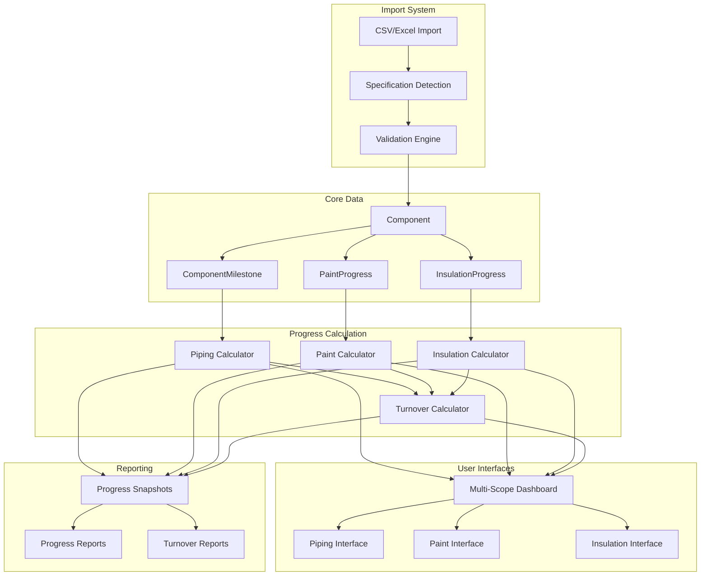
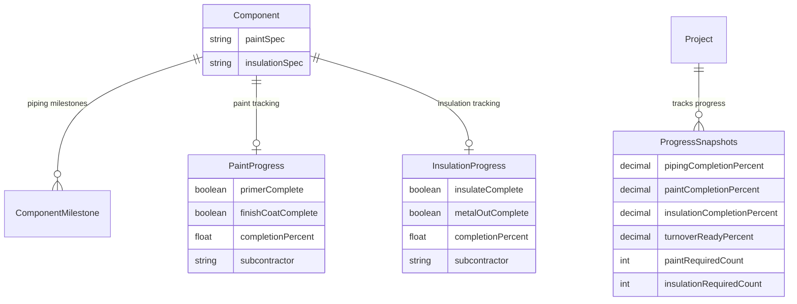

# Paint & Insulation Tracking System - Complete Specification

## Executive Summary

This specification defines a comprehensive Paint and Insulation tracking system for PipeTrak that recognizes these activities as separate subcontractor scopes of work, distinct from piping/mechanical progress but essential for project turnover.

**Key Business Drivers:**
- Paint and Insulation are performed by specialized subcontractors
- These activities are NOT part of piping % completion 
- Each scope has its own independent progress tracking
- All scopes must be complete for final project turnover
- Only components with valid specifications require tracking

**Core Architecture:**
- Specification-driven conditional tracking
- Three separate progress metrics: Piping, Paint, Insulation
- Subcontractor-focused interfaces and workflows
- Overall turnover readiness calculation
- Independent but coordinated progress reporting

## Business Requirements

### 1. Specification-Based Tracking

Components are tracked for Paint and Insulation **only** when they have valid specifications:

**Paint Tracking Required When:**
- Component has `paintSpec` value that is not null, empty, or "NONE"
- Examples of valid specs: "EP-100", "PRIMER-A", "COATING-XYZ"

**Insulation Tracking Required When:**
- Component has `insulationSpec` value that is not null, empty, or "NONE"  
- Examples of valid specs: "51P11C", "MINERAL-WOOL", "CERAMIC-BLANKET"

**No Tracking When:**
- Specification is null, empty string, or "NONE"
- Component doesn't require that type of work

### 2. Scope Separation

The system maintains three distinct scopes of work:

#### Piping/Mechanical Scope
- Traditional component milestone tracking (Receive, Erect, Connect, etc.)
- ROC-weighted progress calculations
- Managed by construction crews
- Excludes any paint/insulation activities

#### Paint Scope  
- Only tracks components with valid `paintSpec`
- Two-milestone progress: Primer (40%), Finish Coat (60%)
- Managed by paint subcontractor
- Independent progress percentage

#### Insulation Scope
- Only tracks components with valid `insulationSpec`
- Two-milestone progress: Insulate (60%), Metal Out (40%)
- Managed by insulation subcontractor  
- Independent progress percentage

### 3. Progress Calculation

Each scope calculates progress independently:

**Piping Progress:**
```
pipingProgress = (Σ completed ROC credits) / (Σ total ROC credits) × 100
```

**Paint Progress:**
```
paintProgress = (components with paint complete) / (components requiring paint) × 100
```

**Insulation Progress:**
```
insulationProgress = (components with insulation complete) / (components requiring insulation) × 100
```

**Overall Turnover Readiness:**
```
turnoverReadiness = weighted average of all applicable scopes
Default weights: Piping (70%), Paint (15%), Insulation (15%)
```

### 4. Subcontractor Management

#### Access Control
- **Piping Crews**: Full access to component milestones, read-only on paint/insulation
- **Paint Subcontractor**: Full access to paint progress, read-only on others
- **Insulation Subcontractor**: Full access to insulation progress, read-only on others
- **Project Managers**: Full access to all scopes and reporting

#### Workflow Requirements
- Bulk update capabilities for subcontractors
- Mobile-optimized interfaces for field updates
- Progress notifications and alerts
- Handoff procedures between scopes

## System Architecture

### High-Level Component Flow



### Data Relationships



## Functional Requirements

### FR-1: Specification Import and Validation

**Description:** System must import and validate paint/insulation specifications during CSV/Excel import.

**Acceptance Criteria:**
- [ ] Detect columns: "Paint Spec", "Insulation Class", "Coating Type", etc.
- [ ] Map specification values to component records
- [ ] Treat null, empty, and "NONE" as no requirement
- [ ] Create progress tracking records only for valid specifications
- [ ] Log warnings for missing specifications on components that typically require them

### FR-2: Independent Progress Tracking

**Description:** Each scope must track progress independently without affecting others.

**Acceptance Criteria:**
- [ ] Piping progress based on ROC milestone completion
- [ ] Paint progress based on primer/finish coat completion
- [ ] Insulation progress based on insulate/metal out completion
- [ ] Progress calculations only include components requiring that scope
- [ ] Real-time updates when progress changes

### FR-3: Subcontractor Interfaces

**Description:** Provide role-specific interfaces for different subcontractors.

**Acceptance Criteria:**
- [ ] Paint subcontractor sees only components requiring paint
- [ ] Insulation subcontractor sees only components requiring insulation
- [ ] Bulk update capabilities for batch progress entry
- [ ] Mobile-optimized for field use
- [ ] Progress validation and error handling

### FR-4: Multi-Scope Dashboard

**Description:** Executive dashboard showing all scope progress and turnover readiness.

**Acceptance Criteria:**
- [ ] Three separate progress bars: Piping, Paint, Insulation
- [ ] Overall turnover readiness indicator
- [ ] Component counts for each scope
- [ ] Drill-down capabilities to component details
- [ ] Export capabilities for all scope data

### FR-5: Turnover Calculation

**Description:** Calculate overall project readiness based on all applicable scopes.

**Acceptance Criteria:**
- [ ] Weighted average calculation with configurable weights
- [ ] Only include scopes that have components requiring them
- [ ] Project is 100% complete only when all scopes are 100%
- [ ] Clear indication of blocking issues by scope

## Non-Functional Requirements

### Performance Requirements
- Import processing: Handle up to 50,000 components with specifications in under 30 seconds
- Progress calculations: Real-time updates within 2 seconds of data changes
- Dashboard loading: Initial load under 3 seconds, updates under 1 second
- Mobile interface: Responsive on devices with 3G connections

### Scalability Requirements
- Support projects with up to 100,000 components
- Handle up to 50 concurrent users updating progress
- Database queries optimized for large datasets
- Efficient indexing for specification-based filtering

### Security Requirements
- Role-based access control for each scope
- Audit trail for all progress updates
- Secure API endpoints with proper authentication
- Data validation to prevent invalid progress states

## Integration Points

### Existing System Integration
- **Component Import System**: Extend to capture specifications
- **Dashboard Functions**: Integrate multi-scope calculations
- **Reporting Module**: Add scope-specific reports
- **Real-time Updates**: Broadcast progress changes by scope
- **User Management**: Extend roles for subcontractor access

### External System Integration
- **ERP Systems**: Export progress data in standard formats
- **Document Management**: Link specifications to component records
- **Mobile Apps**: Provide APIs for field data collection
- **Financial Systems**: Track progress for billing and payment

## Success Metrics

### Business Metrics
- **Visibility**: Clear separation of scope responsibilities
- **Accuracy**: Precise tracking of subcontractor progress
- **Efficiency**: Reduced time for progress reporting and turnover
- **Collaboration**: Improved coordination between scopes

### Technical Metrics
- **Performance**: Dashboard loads under 3 seconds with 10,000+ components
- **Reliability**: 99.9% uptime for progress tracking features
- **Data Integrity**: Zero progress calculation errors
- **User Adoption**: 90%+ of subcontractors use mobile interface

## Risk Analysis

### High Risk Items
- **Data Migration**: Moving existing components to new specification model
- **Performance Impact**: Additional tables and calculations affecting system speed
- **User Training**: Subcontractors learning new interfaces and workflows
- **Scope Creep**: Requests for additional tracking categories beyond paint/insulation

### Mitigation Strategies
- **Phased Rollout**: Implement by project to validate and refine
- **Performance Testing**: Load testing with realistic data volumes
- **Training Program**: Comprehensive onboarding for all user types
- **Clear Requirements**: Well-defined scope boundaries and change control

---

*Document Version: 1.0*  
*Author: System Architect*  
*Date: 2025-08-14*  
*Status: Final Draft*  
*Next Review: Before Phase 1 Implementation*