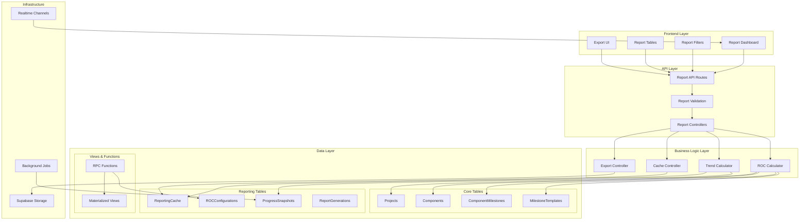

# PipeTrak Reporting Module - Technical Architecture Specification

## Executive Summary

This document defines the complete technical architecture for PipeTrak's reporting module, building upon the existing dashboard functions to deliver Excel-quality reports with real-time field data. The architecture provides ROC-weighted progress calculations, comprehensive audit trails, and high-performance data exports while maintaining the system's Supabase-native approach.

**Core Deliverables:**
- 5 report types: Progress Summary, Component Details, Test Package Readiness, Trend Analysis, Audit Trail
- ROC-based milestone credit calculations with organizational customization
- Streaming exports for large datasets with 5-second generation targets
- Real-time report updates via Supabase channels
- Advanced caching strategy with 5-minute TTL for calculated metrics

## System Overview



## Database Schema for Reporting

### 1. Reporting Cache Table

Stores pre-calculated metrics with configurable TTL for performance optimization.

```sql
-- Migration: 001_create_reporting_tables.sql
CREATE TABLE "ReportingCache" (
    id TEXT PRIMARY KEY DEFAULT gen_random_uuid(),
    "projectId" TEXT NOT NULL REFERENCES "Project"(id) ON DELETE CASCADE,
    "reportType" TEXT NOT NULL, -- 'progress_summary', 'test_readiness', 'trend_analysis'
    "cacheKey" TEXT NOT NULL, -- Hash of filter parameters
    "filters" JSONB NOT NULL, -- Original filter parameters for validation
    "result" JSONB NOT NULL, -- Cached report result
    "calculatedAt" TIMESTAMPTZ NOT NULL DEFAULT NOW(),
    "expiresAt" TIMESTAMPTZ NOT NULL DEFAULT (NOW() + INTERVAL '5 minutes'),
    "calculationDuration" INTEGER, -- Milliseconds for performance tracking
    "rowCount" INTEGER, -- Number of records in result
    "createdBy" TEXT REFERENCES "user"(id),
    
    -- Performance indexes
    CONSTRAINT "idx_cache_unique" UNIQUE ("projectId", "reportType", "cacheKey"),
    INDEX "idx_cache_expiry" ("expiresAt"),
    INDEX "idx_cache_project_type" ("projectId", "reportType"),
    INDEX "idx_cache_calculated" ("calculatedAt" DESC)
);

-- Auto-cleanup expired cache entries
CREATE INDEX "idx_cache_cleanup" ON "ReportingCache" ("expiresAt") WHERE "expiresAt" < NOW();

COMMENT ON TABLE "ReportingCache" IS 'Performance cache for expensive report calculations';
```

### 2. ROC Configurations Table

Organization-specific ROC (Rate of Credit) weight configurations for milestone credit calculations.

```sql
CREATE TABLE "ROCConfigurations" (
    id TEXT PRIMARY KEY DEFAULT gen_random_uuid(),
    "organizationId" TEXT NOT NULL REFERENCES "organization"(id) ON DELETE CASCADE,
    "projectId" TEXT REFERENCES "Project"(id) ON DELETE CASCADE, -- NULL = org default
    "componentType" TEXT, -- NULL = applies to all types
    "milestoneWeights" JSONB NOT NULL, -- {"Receive": 15, "Erect": 35, "Connect": 50}
    "description" TEXT,
    "isDefault" BOOLEAN DEFAULT FALSE,
    "effectiveDate" TIMESTAMPTZ NOT NULL DEFAULT NOW(),
    
    -- Audit fields
    "createdAt" TIMESTAMPTZ NOT NULL DEFAULT NOW(),
    "updatedAt" TIMESTAMPTZ NOT NULL DEFAULT NOW(),
    "createdBy" TEXT NOT NULL REFERENCES "user"(id),
    
    -- Constraints
    CONSTRAINT "roc_weights_valid" CHECK (jsonb_typeof("milestoneWeights") = 'object'),
    
    -- Performance indexes
    INDEX "idx_roc_org_project" ("organizationId", "projectId"),
    INDEX "idx_roc_effective" ("organizationId", "effectiveDate" DESC),
    INDEX "idx_roc_component_type" ("organizationId", "componentType")
);

-- Ensure only one default per organization
CREATE UNIQUE INDEX "idx_roc_org_default" 
ON "ROCConfigurations" ("organizationId") 
WHERE "isDefault" = TRUE AND "projectId" IS NULL;

COMMENT ON TABLE "ROCConfigurations" IS 'Organization-specific milestone weight configurations for ROC calculations';
```

### 3. Progress Snapshots Table

Historical point-in-time progress data for trend analysis and velocity calculations.

```sql
CREATE TABLE "ProgressSnapshots" (
    id TEXT PRIMARY KEY DEFAULT gen_random_uuid(),
    "projectId" TEXT NOT NULL REFERENCES "Project"(id) ON DELETE CASCADE,
    "snapshotDate" DATE NOT NULL,
    "snapshotTime" TIMESTAMPTZ NOT NULL DEFAULT NOW(),
    
    -- Aggregated metrics
    "totalComponents" INTEGER NOT NULL,
    "completedComponents" INTEGER NOT NULL,
    "overallCompletionPercent" DECIMAL(5,2) NOT NULL,
    "rocWeightedPercent" DECIMAL(5,2) NOT NULL,
    
    -- Area/System breakdown
    "areaBreakdown" JSONB NOT NULL, -- [{"area": "Area-1", "completionPercent": 75, "componentCount": 100}]
    "systemBreakdown" JSONB NOT NULL,
    "testPackageBreakdown" JSONB NOT NULL,
    
    -- Velocity metrics
    "dailyVelocity" DECIMAL(8,2), -- Components completed per day
    "weeklyVelocity" DECIMAL(8,2), -- Components completed per week
    "milestoneVelocity" JSONB, -- {"Receive": 5.2, "Erect": 3.1} per day
    
    -- Quality metrics
    "stalledComponents7d" INTEGER DEFAULT 0,
    "stalledComponents14d" INTEGER DEFAULT 0,
    "stalledComponents21d" INTEGER DEFAULT 0,
    
    -- Generation metadata
    "calculationDuration" INTEGER, -- Milliseconds
    "generatedBy" TEXT REFERENCES "user"(id), -- NULL = system generated
    "generationMethod" TEXT DEFAULT 'scheduled', -- 'manual', 'scheduled', 'realtime'
    
    -- Constraints
    CONSTRAINT "completion_percent_valid" CHECK ("overallCompletionPercent" BETWEEN 0 AND 100),
    CONSTRAINT "roc_percent_valid" CHECK ("rocWeightedPercent" BETWEEN 0 AND 100),
    
    -- Performance indexes
    PRIMARY KEY (id),
    UNIQUE INDEX "idx_snapshot_project_date" ("projectId", "snapshotDate"),
    INDEX "idx_snapshot_time" ("snapshotTime" DESC),
    INDEX "idx_snapshot_project_time" ("projectId", "snapshotTime" DESC)
);

-- Partition table by month for performance with large datasets
-- ALTER TABLE "ProgressSnapshots" PARTITION BY RANGE ("snapshotTime");

COMMENT ON TABLE "ProgressSnapshots" IS 'Historical progress snapshots for trend analysis and forecasting';
```

### 4. Report Generations Audit Table

Tracks all report generation requests for auditing, performance monitoring, and usage analytics.

```sql
CREATE TABLE "ReportGenerations" (
    id TEXT PRIMARY KEY DEFAULT gen_random_uuid(),
    "projectId" TEXT NOT NULL REFERENCES "Project"(id) ON DELETE CASCADE,
    "reportType" TEXT NOT NULL,
    "requestedBy" TEXT NOT NULL REFERENCES "user"(id),
    "requestedAt" TIMESTAMPTZ NOT NULL DEFAULT NOW(),
    
    -- Request details
    "filters" JSONB NOT NULL,
    "outputFormat" TEXT NOT NULL, -- 'json', 'csv', 'excel', 'pdf'
    "deliveryMethod" TEXT NOT NULL DEFAULT 'download', -- 'download', 'email', 'api'
    
    -- Processing details
    "status" TEXT NOT NULL DEFAULT 'pending', -- 'pending', 'processing', 'completed', 'failed'
    "startedAt" TIMESTAMPTZ,
    "completedAt" TIMESTAMPTZ,
    "duration" INTEGER, -- Milliseconds
    
    -- Results
    "resultRowCount" INTEGER,
    "resultSize" BIGINT, -- Bytes
    "downloadUrl" TEXT, -- Supabase Storage signed URL
    "downloadExpires" TIMESTAMPTZ,
    
    -- Error tracking
    "errorMessage" TEXT,
    "errorDetails" JSONB,
    
    -- Performance metadata
    "cacheHit" BOOLEAN DEFAULT FALSE,
    "dbQueryTime" INTEGER, -- Milliseconds
    "exportTime" INTEGER, -- Milliseconds
    "memoryUsage" BIGINT, -- Bytes peak usage
    
    -- Constraints
    CONSTRAINT "status_valid" CHECK ("status" IN ('pending', 'processing', 'completed', 'failed')),
    CONSTRAINT "format_valid" CHECK ("outputFormat" IN ('json', 'csv', 'excel', 'pdf')),
    
    -- Performance indexes
    INDEX "idx_report_gen_user" ("requestedBy", "requestedAt" DESC),
    INDEX "idx_report_gen_project" ("projectId", "requestedAt" DESC),
    INDEX "idx_report_gen_status" ("status", "requestedAt"),
    INDEX "idx_report_gen_type" ("reportType", "requestedAt" DESC),
    INDEX "idx_report_gen_cleanup" ("downloadExpires") WHERE "downloadExpires" < NOW()
);

COMMENT ON TABLE "ReportGenerations" IS 'Audit trail and performance tracking for all report generation requests';
```

### 5. Materialized Views for Performance

```sql
-- Component Progress Summary View
CREATE MATERIALIZED VIEW "ComponentProgressSummary" AS
SELECT 
    c."projectId",
    c."area",
    c."system", 
    c."testPackage",
    c.type as "componentType",
    COUNT(*) as "totalCount",
    COUNT(*) FILTER (WHERE c.status = 'COMPLETED') as "completedCount",
    AVG(c."completionPercent") as "avgCompletionPercent",
    
    -- ROC-weighted calculations (using default weights for now)
    AVG(
        CASE 
            WHEN c."workflowType" = 'MILESTONE_DISCRETE' THEN c."completionPercent"
            WHEN c."workflowType" = 'MILESTONE_PERCENTAGE' THEN c."completionPercent" 
            WHEN c."workflowType" = 'MILESTONE_QUANTITY' THEN c."completionPercent"
            ELSE c."completionPercent"
        END
    ) as "rocWeightedPercent",
    
    -- Stalled component counts
    COUNT(*) FILTER (WHERE 
        c.status NOT IN ('COMPLETED', 'NOT_STARTED') AND
        NOT EXISTS (
            SELECT 1 FROM "ComponentMilestone" cm 
            WHERE cm."componentId" = c.id 
            AND cm."isCompleted" = true 
            AND cm."completedAt" > NOW() - INTERVAL '7 days'
        )
    ) as "stalledCount7d",
    
    -- Last updated tracking
    MAX(c."updatedAt") as "lastUpdated",
    MAX(COALESCE(
        (SELECT MAX(cm."completedAt") FROM "ComponentMilestone" cm WHERE cm."componentId" = c.id),
        c."updatedAt"
    )) as "lastActivity"
    
FROM "Component" c
GROUP BY c."projectId", c."area", c."system", c."testPackage", c.type
WITH DATA;

-- Performance indexes for materialized view
CREATE UNIQUE INDEX "idx_comp_progress_unique" 
ON "ComponentProgressSummary" ("projectId", COALESCE("area", ''), COALESCE("system", ''), COALESCE("testPackage", ''), "componentType");

CREATE INDEX "idx_comp_progress_project" ON "ComponentProgressSummary" ("projectId");
CREATE INDEX "idx_comp_progress_completion" ON "ComponentProgressSummary" ("avgCompletionPercent");

-- Refresh materialized view on component changes
CREATE OR REPLACE FUNCTION refresh_component_progress_summary()
RETURNS TRIGGER AS $$
BEGIN
    REFRESH MATERIALIZED VIEW CONCURRENTLY "ComponentProgressSummary";
    RETURN NULL;
END;
$$ LANGUAGE plpgsql;

-- Test Package Readiness View
CREATE MATERIALIZED VIEW "TestPackageReadiness" AS
SELECT 
    c."projectId",
    c."testPackage",
    COUNT(*) as "totalComponents",
    COUNT(*) FILTER (WHERE c.status = 'COMPLETED') as "completedComponents",
    COUNT(*) FILTER (WHERE c."completionPercent" = 100) as "fullyCompleteComponents",
    AVG(c."completionPercent") as "avgCompletionPercent",
    
    -- Readiness calculation (all components must be 100% for testing)
    CASE 
        WHEN COUNT(*) FILTER (WHERE c."completionPercent" < 100) = 0 THEN true
        ELSE false
    END as "isReady",
    
    -- Blocking components (incomplete milestones that prevent testing)
    COUNT(*) FILTER (WHERE 
        c."completionPercent" < 100 AND
        EXISTS (
            SELECT 1 FROM "ComponentMilestone" cm 
            WHERE cm."componentId" = c.id 
            AND cm."milestoneName" IN ('Connect', 'Test', 'Pressure_Test')
            AND cm."isCompleted" = false
        )
    ) as "blockingComponents",
    
    -- Estimated ready date based on current velocity
    CASE 
        WHEN COUNT(*) FILTER (WHERE c."completionPercent" < 100) = 0 THEN NOW()
        ELSE NOW() + (
            COUNT(*) FILTER (WHERE c."completionPercent" < 100) * INTERVAL '1 day' / 
            GREATEST(1, (
                SELECT AVG(daily_completions) FROM (
                    SELECT COUNT(*) as daily_completions
                    FROM "ComponentMilestone" cm2
                    JOIN "Component" c2 ON cm2."componentId" = c2.id
                    WHERE c2."testPackage" = c."testPackage"
                    AND cm2."completedAt" > NOW() - INTERVAL '7 days'
                    GROUP BY DATE(cm2."completedAt")
                ) recent_activity
            ))
        )
    END as "estimatedReadyDate",
    
    MAX(c."updatedAt") as "lastUpdated"
    
FROM "Component" c
WHERE c."testPackage" IS NOT NULL
GROUP BY c."projectId", c."testPackage"
WITH DATA;

-- Performance indexes
CREATE UNIQUE INDEX "idx_test_package_unique" 
ON "TestPackageReadiness" ("projectId", "testPackage");

CREATE INDEX "idx_test_package_ready" ON "TestPackageReadiness" ("isReady", "projectId");
```

## Supabase RPC Functions for ROC Calculations

Building upon the existing dashboard functions, here are the new reporting-specific RPC functions:

### 1. ROC-Weighted Progress Calculator

```sql
-- Function: calculate_roc_weighted_progress
CREATE OR REPLACE FUNCTION calculate_roc_weighted_progress(
    p_project_id TEXT,
    p_filters JSONB DEFAULT '{}'::jsonb
)
RETURNS JSONB
LANGUAGE plpgsql
SECURITY DEFINER
STABLE
AS $$
DECLARE
    v_result JSONB;
    v_roc_config JSONB;
    v_area_filter TEXT[];
    v_system_filter TEXT[];
    v_test_package_filter TEXT[];
    v_component_type_filter TEXT[];
    v_status_filter TEXT[];
BEGIN
    -- Validate project access
    IF NOT EXISTS(SELECT 1 FROM "Project" WHERE id = p_project_id) THEN
        RETURN jsonb_build_object('error', 'Project not found');
    END IF;
    
    -- Extract filters
    v_area_filter := CASE 
        WHEN p_filters ? 'areas' THEN 
            ARRAY(SELECT jsonb_array_elements_text(p_filters->'areas'))
        ELSE NULL 
    END;
    
    v_system_filter := CASE 
        WHEN p_filters ? 'systems' THEN 
            ARRAY(SELECT jsonb_array_elements_text(p_filters->'systems'))
        ELSE NULL 
    END;
    
    v_test_package_filter := CASE 
        WHEN p_filters ? 'testPackages' THEN 
            ARRAY(SELECT jsonb_array_elements_text(p_filters->'testPackages'))
        ELSE NULL 
    END;
    
    v_component_type_filter := CASE 
        WHEN p_filters ? 'componentTypes' THEN 
            ARRAY(SELECT jsonb_array_elements_text(p_filters->'componentTypes'))
        ELSE NULL 
    END;
    
    v_status_filter := CASE 
        WHEN p_filters ? 'statuses' THEN 
            ARRAY(SELECT jsonb_array_elements_text(p_filters->'statuses'))
        ELSE NULL 
    END;
    
    -- Get ROC configuration for this project/organization
    SELECT COALESCE(
        -- Project-specific configuration
        (SELECT "milestoneWeights" FROM "ROCConfigurations" 
         WHERE "projectId" = p_project_id AND "effectiveDate" <= NOW() 
         ORDER BY "effectiveDate" DESC LIMIT 1),
        -- Organization default configuration
        (SELECT "milestoneWeights" FROM "ROCConfigurations" rc
         JOIN "Project" p ON p."organizationId" = rc."organizationId"
         WHERE p.id = p_project_id AND rc."isDefault" = true AND rc."projectId" IS NULL
         ORDER BY rc."effectiveDate" DESC LIMIT 1),
        -- System default weights
        '{"Receive": 10, "Erect": 30, "Connect": 40, "Test": 15, "Complete": 5}'::jsonb
    ) INTO v_roc_config;
    
    -- Calculate ROC-weighted progress with filters
    WITH filtered_components AS (
        SELECT 
            c.*,
            COALESCE(c."area", 'Unassigned') as area_clean,
            COALESCE(c."system", 'Unassigned') as system_clean,
            COALESCE(c."testPackage", 'Unassigned') as test_package_clean
        FROM "Component" c
        WHERE c."projectId" = p_project_id
        AND (v_area_filter IS NULL OR c."area" = ANY(v_area_filter))
        AND (v_system_filter IS NULL OR c."system" = ANY(v_system_filter))
        AND (v_test_package_filter IS NULL OR c."testPackage" = ANY(v_test_package_filter))
        AND (v_component_type_filter IS NULL OR c.type = ANY(v_component_type_filter))
        AND (v_status_filter IS NULL OR c.status::text = ANY(v_status_filter))
    ),
    component_roc_calculations AS (
        SELECT 
            fc.*,
            -- Calculate ROC-weighted percentage for each component
            CASE 
                WHEN fc."workflowType" = 'MILESTONE_DISCRETE' THEN
                    (SELECT 
                        COALESCE(SUM(
                            CASE WHEN cm."isCompleted" THEN 
                                COALESCE((v_roc_config->>cm."milestoneName")::numeric, 0)
                            ELSE 0 END
                        ), 0)
                        FROM "ComponentMilestone" cm 
                        WHERE cm."componentId" = fc.id
                    )
                WHEN fc."workflowType" = 'MILESTONE_PERCENTAGE' THEN
                    (SELECT 
                        COALESCE(SUM(
                            CASE WHEN cm."isCompleted" THEN 
                                COALESCE((v_roc_config->>cm."milestoneName")::numeric, 0) *
                                COALESCE(cm."percentageValue", 100) / 100.0
                            ELSE 0 END
                        ), 0)
                        FROM "ComponentMilestone" cm 
                        WHERE cm."componentId" = fc.id
                    )
                ELSE fc."completionPercent"
            END as roc_weighted_percent
        FROM filtered_components fc
    ),
    summary_calculations AS (
        SELECT 
            -- Overall metrics
            COUNT(*) as total_components,
            COUNT(*) FILTER (WHERE status = 'COMPLETED') as completed_components,
            ROUND(AVG("completionPercent"), 2) as avg_completion_percent,
            ROUND(AVG(roc_weighted_percent), 2) as roc_weighted_percent,
            
            -- Breakdown by area
            jsonb_agg(DISTINCT jsonb_build_object(
                'area', area_clean,
                'totalCount', COUNT(*) OVER (PARTITION BY area_clean),
                'completedCount', COUNT(*) FILTER (WHERE status = 'COMPLETED') OVER (PARTITION BY area_clean),
                'completionPercent', ROUND(AVG("completionPercent") OVER (PARTITION BY area_clean), 2),
                'rocWeightedPercent', ROUND(AVG(roc_weighted_percent) OVER (PARTITION BY area_clean), 2)
            )) FILTER (WHERE area_clean != 'Unassigned' OR COUNT(*) FILTER (WHERE area_clean = 'Unassigned') > 0) as area_breakdown,
            
            -- Breakdown by system
            jsonb_agg(DISTINCT jsonb_build_object(
                'system', system_clean,
                'totalCount', COUNT(*) OVER (PARTITION BY system_clean),
                'completedCount', COUNT(*) FILTER (WHERE status = 'COMPLETED') OVER (PARTITION BY system_clean),
                'completionPercent', ROUND(AVG("completionPercent") OVER (PARTITION BY system_clean), 2),
                'rocWeightedPercent', ROUND(AVG(roc_weighted_percent) OVER (PARTITION BY system_clean), 2)
            )) FILTER (WHERE system_clean != 'Unassigned' OR COUNT(*) FILTER (WHERE system_clean = 'Unassigned') > 0) as system_breakdown,
            
            -- Breakdown by test package
            jsonb_agg(DISTINCT jsonb_build_object(
                'testPackage', test_package_clean,
                'totalCount', COUNT(*) OVER (PARTITION BY test_package_clean),
                'completedCount', COUNT(*) FILTER (WHERE status = 'COMPLETED') OVER (PARTITION BY test_package_clean),
                'completionPercent', ROUND(AVG("completionPercent") OVER (PARTITION BY test_package_clean), 2),
                'rocWeightedPercent', ROUND(AVG(roc_weighted_percent) OVER (PARTITION BY test_package_clean), 2)
            )) FILTER (WHERE test_package_clean != 'Unassigned' OR COUNT(*) FILTER (WHERE test_package_clean = 'Unassigned') > 0) as test_package_breakdown
            
        FROM component_roc_calculations
    )
    SELECT jsonb_build_object(
        'summary', jsonb_build_object(
            'totalComponents', sc.total_components,
            'completedComponents', sc.completed_components,
            'completionPercent', sc.avg_completion_percent,
            'rocWeightedPercent', sc.roc_weighted_percent
        ),
        'areaBreakdown', COALESCE(sc.area_breakdown, '[]'::jsonb),
        'systemBreakdown', COALESCE(sc.system_breakdown, '[]'::jsonb),
        'testPackageBreakdown', COALESCE(sc.test_package_breakdown, '[]'::jsonb),
        'rocConfiguration', v_roc_config,
        'filters', p_filters,
        'generatedAt', extract(epoch from NOW()),
        'calculationMethod', 'roc_weighted'
    )
    INTO v_result
    FROM summary_calculations sc;
    
    RETURN v_result;
END;
$$;

-- Grant permissions
GRANT EXECUTE ON FUNCTION calculate_roc_weighted_progress(TEXT, JSONB) TO authenticated;
```

### 2. Progress Report with Caching

```sql
-- Function: generate_progress_report (with caching)
CREATE OR REPLACE FUNCTION generate_progress_report(
    p_project_id TEXT,
    p_filters JSONB DEFAULT '{}'::jsonb,
    p_force_refresh BOOLEAN DEFAULT false
)
RETURNS JSONB
LANGUAGE plpgsql
SECURITY DEFINER
STABLE
AS $$
DECLARE
    v_result JSONB;
    v_cache_key TEXT;
    v_cached_result RECORD;
    v_calculation_start TIMESTAMPTZ;
    v_calculation_duration INTEGER;
BEGIN
    v_calculation_start := clock_timestamp();
    
    -- Generate cache key from filters
    v_cache_key := md5(p_filters::text);
    
    -- Check cache first (unless force refresh)
    IF NOT p_force_refresh THEN
        SELECT result, "calculatedAt", "expiresAt"
        INTO v_cached_result
        FROM "ReportingCache"
        WHERE "projectId" = p_project_id 
        AND "reportType" = 'progress_summary'
        AND "cacheKey" = v_cache_key
        AND "expiresAt" > NOW()
        LIMIT 1;
        
        -- Return cached result if valid
        IF v_cached_result.result IS NOT NULL THEN
            RETURN v_cached_result.result || jsonb_build_object(
                'fromCache', true,
                'cachedAt', extract(epoch from v_cached_result."calculatedAt"),
                'cacheExpiresAt', extract(epoch from v_cached_result."expiresAt")
            );
        END IF;
    END IF;
    
    -- Calculate fresh result
    SELECT calculate_roc_weighted_progress(p_project_id, p_filters) INTO v_result;
    
    -- Calculate processing time
    v_calculation_duration := EXTRACT(MILLISECONDS FROM (clock_timestamp() - v_calculation_start))::integer;
    
    -- Update cache
    INSERT INTO "ReportingCache" (
        "projectId",
        "reportType",
        "cacheKey",
        "filters",
        "result",
        "calculatedAt",
        "expiresAt",
        "calculationDuration"
    ) VALUES (
        p_project_id,
        'progress_summary',
        v_cache_key,
        p_filters,
        v_result,
        NOW(),
        NOW() + INTERVAL '5 minutes',
        v_calculation_duration
    )
    ON CONFLICT ("projectId", "reportType", "cacheKey")
    DO UPDATE SET
        "result" = EXCLUDED."result",
        "calculatedAt" = EXCLUDED."calculatedAt",
        "expiresAt" = EXCLUDED."expiresAt",
        "calculationDuration" = EXCLUDED."calculationDuration";
    
    -- Add cache metadata to result
    v_result := v_result || jsonb_build_object(
        'fromCache', false,
        'calculationDuration', v_calculation_duration,
        'cacheExpiresAt', extract(epoch from (NOW() + INTERVAL '5 minutes'))
    );
    
    RETURN v_result;
END;
$$;

-- Grant permissions
GRANT EXECUTE ON FUNCTION generate_progress_report(TEXT, JSONB, BOOLEAN) TO authenticated;
```

### 3. Trend Analysis Calculator

```sql
-- Function: calculate_trend_analysis
CREATE OR REPLACE FUNCTION calculate_trend_analysis(
    p_project_id TEXT,
    p_start_date DATE DEFAULT (CURRENT_DATE - INTERVAL '30 days')::date,
    p_end_date DATE DEFAULT CURRENT_DATE,
    p_group_by TEXT DEFAULT 'daily' -- 'daily', 'weekly', 'monthly'
)
RETURNS JSONB
LANGUAGE plpgsql
SECURITY DEFINER
STABLE
AS $$
DECLARE
    v_result JSONB;
    v_date_series JSONB := '[]'::jsonb;
    v_completion_trend JSONB := '[]'::jsonb;
    v_velocity_metrics JSONB;
    v_forecast_data JSONB;
BEGIN
    -- Validate project access
    IF NOT EXISTS(SELECT 1 FROM "Project" WHERE id = p_project_id) THEN
        RETURN jsonb_build_object('error', 'Project not found');
    END IF;
    
    -- Generate date series and completion trends
    WITH date_series AS (
        SELECT generate_series(p_start_date, p_end_date, 
            CASE p_group_by 
                WHEN 'weekly' THEN '1 week'::interval
                WHEN 'monthly' THEN '1 month'::interval  
                ELSE '1 day'::interval
            END
        )::date as period_date
    ),
    daily_completions AS (
        SELECT 
            ds.period_date,
            COUNT(cm."completedAt") as completions_count,
            COUNT(DISTINCT cm."componentId") as components_completed,
            COALESCE(AVG(c."completionPercent"), 0) as avg_completion_percent,
            -- Calculate cumulative completion
            SUM(COUNT(cm."completedAt")) OVER (ORDER BY ds.period_date ROWS UNBOUNDED PRECEDING) as cumulative_completions
        FROM date_series ds
        LEFT JOIN "ComponentMilestone" cm ON DATE(cm."completedAt") = ds.period_date
        LEFT JOIN "Component" c ON cm."componentId" = c.id AND c."projectId" = p_project_id
        WHERE cm."completedAt" IS NULL OR cm."isCompleted" = true
        GROUP BY ds.period_date
        ORDER BY ds.period_date
    ),
    velocity_calculations AS (
        SELECT 
            AVG(completions_count) FILTER (WHERE completions_count > 0) as avg_daily_velocity,
            STDDEV(completions_count) FILTER (WHERE completions_count > 0) as velocity_stddev,
            MAX(completions_count) as max_daily_completions,
            MIN(completions_count) FILTER (WHERE completions_count > 0) as min_daily_completions,
            
            -- Weekly velocity (last 7 days)
            AVG(completions_count) FILTER (WHERE period_date > CURRENT_DATE - INTERVAL '7 days') as recent_velocity,
            
            -- Calculate trend slope (linear regression)
            CASE 
                WHEN COUNT(*) > 1 THEN
                    (COUNT(*) * SUM(EXTRACT(EPOCH FROM period_date::timestamp - p_start_date::timestamp) / 86400 * completions_count) - 
                     SUM(EXTRACT(EPOCH FROM period_date::timestamp - p_start_date::timestamp) / 86400) * SUM(completions_count)) /
                    (COUNT(*) * SUM(POWER(EXTRACT(EPOCH FROM period_date::timestamp - p_start_date::timestamp) / 86400, 2)) - 
                     POWER(SUM(EXTRACT(EPOCH FROM period_date::timestamp - p_start_date::timestamp) / 86400), 2))
                ELSE 0
            END as trend_slope
        FROM daily_completions
        WHERE period_date <= CURRENT_DATE
    ),
    project_totals AS (
        SELECT 
            COUNT(*) as total_components,
            COUNT(*) FILTER (WHERE status = 'COMPLETED') as completed_components,
            COUNT(*) FILTER (WHERE status != 'COMPLETED') as remaining_components
        FROM "Component" 
        WHERE "projectId" = p_project_id
    )
    SELECT 
        -- Historical trend data
        jsonb_agg(
            jsonb_build_object(
                'date', dc.period_date,
                'completions', dc.completions_count,
                'componentsCompleted', dc.components_completed,
                'cumulativeCompletions', dc.cumulative_completions,
                'avgCompletionPercent', ROUND(dc.avg_completion_percent, 2)
            ) ORDER BY dc.period_date
        ) as completion_trend,
        
        -- Velocity metrics
        jsonb_build_object(
            'avgDailyVelocity', ROUND(vc.avg_daily_velocity, 2),
            'recentVelocity', ROUND(vc.recent_velocity, 2),
            'maxDailyCompletions', vc.max_daily_completions,
            'minDailyCompletions', vc.min_daily_completions,
            'velocityStdDev', ROUND(vc.velocity_stddev, 2),
            'trendSlope', ROUND(vc.trend_slope, 4)
        ) as velocity_metrics,
        
        -- Forecast calculations
        jsonb_build_object(
            'totalComponents', pt.total_components,
            'completedComponents', pt.completed_components,
            'remainingComponents', pt.remaining_components,
            'estimatedCompletionDate', CASE 
                WHEN vc.recent_velocity > 0 THEN 
                    CURRENT_DATE + (pt.remaining_components / vc.recent_velocity)::integer * INTERVAL '1 day'
                ELSE NULL
            END,
            'confidenceLevel', CASE 
                WHEN vc.velocity_stddev / NULLIF(vc.avg_daily_velocity, 0) < 0.3 THEN 'high'
                WHEN vc.velocity_stddev / NULLIF(vc.avg_daily_velocity, 0) < 0.6 THEN 'medium'
                ELSE 'low'
            END
        ) as forecast_data
        
    INTO v_completion_trend, v_velocity_metrics, v_forecast_data
    FROM daily_completions dc
    CROSS JOIN velocity_calculations vc
    CROSS JOIN project_totals pt;
    
    -- Build final result
    v_result := jsonb_build_object(
        'projectId', p_project_id,
        'dateRange', jsonb_build_object(
            'startDate', p_start_date,
            'endDate', p_end_date,
            'groupBy', p_group_by
        ),
        'completionTrend', COALESCE(v_completion_trend, '[]'::jsonb),
        'velocityMetrics', v_velocity_metrics,
        'forecastData', v_forecast_data,
        'generatedAt', extract(epoch from NOW())
    );
    
    RETURN v_result;
END;
$$;

-- Grant permissions  
GRANT EXECUTE ON FUNCTION calculate_trend_analysis(TEXT, DATE, DATE, TEXT) TO authenticated;
```

### 4. Component Details with Audit Trail

```sql
-- Function: get_component_details_report
CREATE OR REPLACE FUNCTION get_component_details_report(
    p_project_id TEXT,
    p_filters JSONB DEFAULT '{}'::jsonb,
    p_limit INTEGER DEFAULT 100,
    p_offset INTEGER DEFAULT 0,
    p_include_audit BOOLEAN DEFAULT false
)
RETURNS JSONB
LANGUAGE plpgsql
SECURITY DEFINER
STABLE
AS $$
DECLARE
    v_result JSONB;
    v_components JSONB;
    v_total_count INTEGER;
    v_filters_sql TEXT := '';
    v_params TEXT[] := ARRAY[]::TEXT[];
BEGIN
    -- Validate project access
    IF NOT EXISTS(SELECT 1 FROM "Project" WHERE id = p_project_id) THEN
        RETURN jsonb_build_object('error', 'Project not found');
    END IF;
    
    -- Build dynamic filters
    IF p_filters ? 'areas' THEN
        v_filters_sql := v_filters_sql || ' AND c."area" = ANY($' || array_length(v_params, 1) + 1 || ')';
        v_params := v_params || ARRAY[p_filters->>'areas'];
    END IF;
    
    IF p_filters ? 'systems' THEN
        v_filters_sql := v_filters_sql || ' AND c."system" = ANY($' || array_length(v_params, 1) + 1 || ')';
        v_params := v_params || ARRAY[p_filters->>'systems'];
    END IF;
    
    IF p_filters ? 'statuses' THEN
        v_filters_sql := v_filters_sql || ' AND c."status"::text = ANY($' || array_length(v_params, 1) + 1 || ')';
        v_params := v_params || ARRAY[p_filters->>'statuses'];
    END IF;
    
    IF p_filters ? 'testPackages' THEN
        v_filters_sql := v_filters_sql || ' AND c."testPackage" = ANY($' || array_length(v_params, 1) + 1 || ')';
        v_params := v_params || ARRAY[p_filters->>'testPackages'];
    END IF;
    
    IF p_filters ? 'componentTypes' THEN
        v_filters_sql := v_filters_sql || ' AND c."type" = ANY($' || array_length(v_params, 1) + 1 || ')';
        v_params := v_params || ARRAY[p_filters->>'componentTypes'];
    END IF;
    
    -- Get total count for pagination
    EXECUTE format('
        SELECT COUNT(*) 
        FROM "Component" c 
        LEFT JOIN "Drawing" d ON c."drawingId" = d.id
        WHERE c."projectId" = $1 %s
    ', v_filters_sql) 
    INTO v_total_count
    USING p_project_id;
    
    -- Get components with milestone details
    WITH component_details AS (
        SELECT 
            c.id,
            c."componentId",
            c."displayId",
            c.type,
            c.spec,
            c.size,
            c.material,
            c."area",
            c."system", 
            c."testPackage",
            c.status,
            c."completionPercent",
            c."workflowType",
            c."createdAt",
            c."updatedAt",
            c."installationDate",
            
            -- Drawing information
            d.number as "drawingNumber",
            d.title as "drawingTitle",
            
            -- Milestone details
            jsonb_agg(
                CASE WHEN cm.id IS NOT NULL THEN
                    jsonb_build_object(
                        'name', cm."milestoneName",
                        'order', cm."milestoneOrder",
                        'weight', cm.weight,
                        'isCompleted', cm."isCompleted",
                        'completedAt', cm."completedAt",
                        'completedBy', cm."completedBy",
                        'percentageValue', cm."percentageValue",
                        'quantityValue', cm."quantityValue"
                    )
                ELSE NULL END
                ORDER BY cm."milestoneOrder"
            ) FILTER (WHERE cm.id IS NOT NULL) as milestones,
            
            -- Last activity
            GREATEST(c."updatedAt", MAX(cm."updatedAt")) as "lastActivity",
            
            -- Audit information (if requested)
            CASE WHEN p_include_audit THEN
                (SELECT jsonb_agg(
                    jsonb_build_object(
                        'timestamp', al."timestamp",
                        'action', al.action,
                        'userId', al."userId", 
                        'changes', al.changes
                    ) ORDER BY al."timestamp" DESC
                ) FROM "AuditLog" al 
                WHERE al."componentId" = c.id 
                LIMIT 5)
            ELSE NULL END as audit_trail
            
        FROM "Component" c
        LEFT JOIN "Drawing" d ON c."drawingId" = d.id
        LEFT JOIN "ComponentMilestone" cm ON c.id = cm."componentId"
        WHERE c."projectId" = p_project_id
        GROUP BY c.id, d.number, d.title
        ORDER BY c."componentId", c."instanceNumber"
        LIMIT p_limit OFFSET p_offset
    )
    SELECT jsonb_agg(
        jsonb_build_object(
            'id', cd.id,
            'componentId', cd."componentId",
            'displayId', cd."displayId",
            'type', cd.type,
            'spec', cd.spec,
            'size', cd.size,
            'material', cd.material,
            'area', cd."area",
            'system', cd."system",
            'testPackage', cd."testPackage",
            'status', cd.status,
            'completionPercent', cd."completionPercent",
            'workflowType', cd."workflowType",
            'drawingNumber', cd."drawingNumber",
            'drawingTitle', cd."drawingTitle",
            'milestones', COALESCE(cd.milestones, '[]'::jsonb),
            'lastActivity', cd."lastActivity",
            'auditTrail', cd.audit_trail,
            'createdAt', cd."createdAt",
            'updatedAt', cd."updatedAt",
            'installationDate', cd."installationDate"
        )
    ) INTO v_components
    FROM component_details cd;
    
    -- Build result with pagination metadata
    v_result := jsonb_build_object(
        'components', COALESCE(v_components, '[]'::jsonb),
        'pagination', jsonb_build_object(
            'total', v_total_count,
            'limit', p_limit,
            'offset', p_offset,
            'hasNext', (p_offset + p_limit) < v_total_count,
            'hasPrev', p_offset > 0
        ),
        'filters', p_filters,
        'generatedAt', extract(epoch from NOW())
    );
    
    RETURN v_result;
END;
$$;

-- Grant permissions
GRANT EXECUTE ON FUNCTION get_component_details_report(TEXT, JSONB, INTEGER, INTEGER, BOOLEAN) TO authenticated;
```

### 5. Test Package Readiness with Blocking Analysis

```sql
-- Function: get_test_package_readiness_report
CREATE OR REPLACE FUNCTION get_test_package_readiness_report(
    p_project_id TEXT,
    p_test_package TEXT DEFAULT NULL
)
RETURNS JSONB
LANGUAGE plpgsql
SECURITY DEFINER
STABLE
AS $$
DECLARE
    v_result JSONB;
    v_packages JSONB;
BEGIN
    -- Validate project access
    IF NOT EXISTS(SELECT 1 FROM "Project" WHERE id = p_project_id) THEN
        RETURN jsonb_build_object('error', 'Project not found');
    END IF;
    
    WITH test_package_analysis AS (
        SELECT 
            COALESCE(c."testPackage", 'Unassigned') as package_name,
            COUNT(*) as total_components,
            COUNT(*) FILTER (WHERE c.status = 'COMPLETED') as completed_components,
            COUNT(*) FILTER (WHERE c."completionPercent" = 100) as fully_complete_components,
            ROUND(AVG(c."completionPercent"), 2) as avg_completion_percent,
            
            -- Readiness determination (all test-relevant milestones must be complete)
            (COUNT(*) FILTER (WHERE c."completionPercent" < 100) = 0) as is_ready_for_test,
            
            -- Identify blocking components and milestones
            jsonb_agg(
                CASE 
                    WHEN c."completionPercent" < 100 THEN
                        jsonb_build_object(
                            'componentId', c."componentId",
                            'displayId', c."displayId",
                            'type', c.type,
                            'completionPercent', c."completionPercent",
                            'blockingMilestones', (
                                SELECT jsonb_agg(
                                    jsonb_build_object(
                                        'name', cm."milestoneName",
                                        'isCompleted', cm."isCompleted",
                                        'weight', cm.weight
                                    )
                                )
                                FROM "ComponentMilestone" cm 
                                WHERE cm."componentId" = c.id 
                                AND cm."isCompleted" = false
                                AND cm."milestoneName" IN ('Connect', 'Test', 'Pressure_Test', 'QC_Complete')
                            )
                        )
                    ELSE NULL 
                END
            ) FILTER (WHERE c."completionPercent" < 100) as blocking_components,
            
            -- Test requirements summary
            COUNT(*) FILTER (WHERE c."testRequired" = 'Yes') as test_required_count,
            COUNT(*) FILTER (WHERE c."testRequired" = 'No') as test_not_required_count,
            array_agg(DISTINCT c."testPressure") FILTER (WHERE c."testPressure" IS NOT NULL) as test_pressures,
            
            -- Completion velocity for estimation
            (SELECT COUNT(*) 
             FROM "ComponentMilestone" cm2 
             JOIN "Component" c2 ON cm2."componentId" = c2.id
             WHERE c2."testPackage" = COALESCE(c."testPackage", 'Unassigned')
             AND c2."projectId" = p_project_id
             AND cm2."completedAt" > NOW() - INTERVAL '7 days'
             AND cm2."isCompleted" = true
            ) as recent_completions_7d,
            
            -- Estimated ready date
            CASE 
                WHEN COUNT(*) FILTER (WHERE c."completionPercent" < 100) = 0 THEN NOW()
                WHEN (SELECT COUNT(*) 
                      FROM "ComponentMilestone" cm2 
                      JOIN "Component" c2 ON cm2."componentId" = c2.id
                      WHERE c2."testPackage" = COALESCE(c."testPackage", 'Unassigned')
                      AND c2."projectId" = p_project_id
                      AND cm2."completedAt" > NOW() - INTERVAL '7 days'
                      AND cm2."isCompleted" = true) > 0 
                THEN NOW() + (
                    (COUNT(*) FILTER (WHERE c."completionPercent" < 100))::double precision / 
                    ((SELECT COUNT(*) 
                      FROM "ComponentMilestone" cm2 
                      JOIN "Component" c2 ON cm2."componentId" = c2.id
                      WHERE c2."testPackage" = COALESCE(c."testPackage", 'Unassigned')
                      AND c2."projectId" = p_project_id
                      AND cm2."completedAt" > NOW() - INTERVAL '7 days'
                      AND cm2."isCompleted" = true) / 7.0)
                ) * INTERVAL '1 day'
                ELSE NULL
            END as estimated_ready_date,
            
            MAX(c."updatedAt") as last_updated
            
        FROM "Component" c
        WHERE c."projectId" = p_project_id
        AND c."testPackage" IS NOT NULL
        AND (p_test_package IS NULL OR c."testPackage" = p_test_package)
        GROUP BY COALESCE(c."testPackage", 'Unassigned')
    )
    SELECT jsonb_agg(
        jsonb_build_object(
            'packageName', tpa.package_name,
            'totalComponents', tpa.total_components,
            'completedComponents', tpa.completed_components,
            'fullyCompleteComponents', tpa.fully_complete_components,
            'completionPercent', tpa.avg_completion_percent,
            'isReadyForTest', tpa.is_ready_for_test,
            'testRequiredCount', tpa.test_required_count,
            'testNotRequiredCount', tpa.test_not_required_count,
            'testPressures', tpa.test_pressures,
            'blockingComponents', COALESCE(tpa.blocking_components, '[]'::jsonb),
            'recentCompletions7d', tpa.recent_completions_7d,
            'estimatedReadyDate', tpa.estimated_ready_date,
            'lastUpdated', tpa.last_updated
        ) ORDER BY tpa.package_name
    ) INTO v_packages
    FROM test_package_analysis tpa;
    
    v_result := jsonb_build_object(
        'testPackages', COALESCE(v_packages, '[]'::jsonb),
        'summary', jsonb_build_object(
            'totalPackages', (SELECT COUNT(*) FROM test_package_analysis),
            'readyPackages', (SELECT COUNT(*) FROM test_package_analysis WHERE is_ready_for_test),
            'totalComponentsInPackages', (SELECT SUM(total_components) FROM test_package_analysis),
            'completedComponentsInPackages', (SELECT SUM(completed_components) FROM test_package_analysis)
        ),
        'generatedAt', extract(epoch from NOW())
    );
    
    RETURN v_result;
END;
$$;

-- Grant permissions
GRANT EXECUTE ON FUNCTION get_test_package_readiness_report(TEXT, TEXT) TO authenticated;
```

## API Contracts for Report Types

### 1. Report API Routes Structure

```typescript
// File: /packages/api/src/routes/pipetrak/reports.ts
import { Hono } from "hono";
import { z } from "zod";
import { authMiddleware } from "../../middleware/auth";
import { db as prisma } from "@repo/database";
import { ReportExportService } from "../../lib/report-export";
import { ReportCacheService } from "../../lib/report-cache";

// Validation schemas
const ReportFiltersSchema = z.object({
  areas: z.array(z.string()).optional(),
  systems: z.array(z.string()).optional(),
  testPackages: z.array(z.string()).optional(),
  componentTypes: z.array(z.string()).optional(),
  statuses: z.array(z.string()).optional(),
  dateRange: z.object({
    start: z.string().datetime().optional(),
    end: z.string().datetime().optional(),
  }).optional(),
});

const ReportExportSchema = z.object({
  format: z.enum(['json', 'csv', 'excel', 'pdf']),
  deliveryMethod: z.enum(['download', 'email']).default('download'),
  emailTo: z.string().email().optional(),
  includeAuditTrail: z.boolean().default(false),
});

const PaginationSchema = z.object({
  limit: z.number().int().min(1).max(1000).default(100),
  offset: z.number().int().min(0).default(0),
});

export const reportsRouter = new Hono()
  .use("*", authMiddleware)

  // Progress Summary Report
  .get("/progress-summary/:projectId", async (c) => {
    try {
      const projectId = c.req.param("projectId");
      const filters = ReportFiltersSchema.parse(c.req.query());
      const forceRefresh = c.req.query("forceRefresh") === "true";
      
      // Verify project access
      await verifyProjectAccess(c, projectId);
      
      // Generate report using RPC function with caching
      const result = await prisma.$queryRaw`
        SELECT generate_progress_report(${projectId}, ${JSON.stringify(filters)}, ${forceRefresh})
      `;
      
      return c.json({
        success: true,
        data: result[0].generate_progress_report,
        reportType: 'progress_summary'
      });
      
    } catch (error) {
      return handleReportError(c, error, 'progress_summary');
    }
  })

  // Component Details Report with Pagination
  .get("/component-details/:projectId", async (c) => {
    try {
      const projectId = c.req.param("projectId");
      const filters = ReportFiltersSchema.parse(c.req.query());
      const pagination = PaginationSchema.parse(c.req.query());
      const includeAudit = c.req.query("includeAudit") === "true";
      
      await verifyProjectAccess(c, projectId);
      
      const result = await prisma.$queryRaw`
        SELECT get_component_details_report(
          ${projectId}, 
          ${JSON.stringify(filters)}, 
          ${pagination.limit}, 
          ${pagination.offset}, 
          ${includeAudit}
        )
      `;
      
      return c.json({
        success: true,
        data: result[0].get_component_details_report,
        reportType: 'component_details'
      });
      
    } catch (error) {
      return handleReportError(c, error, 'component_details');
    }
  })

  // Test Package Readiness Report
  .get("/test-package-readiness/:projectId", async (c) => {
    try {
      const projectId = c.req.param("projectId");
      const testPackage = c.req.query("testPackage") || null;
      
      await verifyProjectAccess(c, projectId);
      
      const result = await prisma.$queryRaw`
        SELECT get_test_package_readiness_report(${projectId}, ${testPackage})
      `;
      
      return c.json({
        success: true,
        data: result[0].get_test_package_readiness_report,
        reportType: 'test_package_readiness'
      });
      
    } catch (error) {
      return handleReportError(c, error, 'test_package_readiness');
    }
  })

  // Trend Analysis Report
  .get("/trend-analysis/:projectId", async (c) => {
    try {
      const projectId = c.req.param("projectId");
      const startDate = c.req.query("startDate") || null;
      const endDate = c.req.query("endDate") || null;
      const groupBy = c.req.query("groupBy") || 'daily';
      
      await verifyProjectAccess(c, projectId);
      
      const result = await prisma.$queryRaw`
        SELECT calculate_trend_analysis(
          ${projectId}, 
          ${startDate ? new Date(startDate) : null}, 
          ${endDate ? new Date(endDate) : null}, 
          ${groupBy}
        )
      `;
      
      return c.json({
        success: true,
        data: result[0].calculate_trend_analysis,
        reportType: 'trend_analysis'
      });
      
    } catch (error) {
      return handleReportError(c, error, 'trend_analysis');
    }
  })

  // Audit Trail Report
  .get("/audit-trail/:projectId", async (c) => {
    try {
      const projectId = c.req.param("projectId");
      const componentId = c.req.query("componentId");
      const userId = c.req.query("userId");
      const pagination = PaginationSchema.parse(c.req.query());
      const dateRange = c.req.query("dateRange") ? JSON.parse(c.req.query("dateRange")) : null;
      
      await verifyProjectAccess(c, projectId);
      
      // Build audit query with filters
      const auditFilters: any = { projectId };
      if (componentId) auditFilters.componentId = componentId;
      if (userId) auditFilters.userId = userId;
      if (dateRange?.start) auditFilters.timestamp = { gte: new Date(dateRange.start) };
      if (dateRange?.end) {
        auditFilters.timestamp = { 
          ...auditFilters.timestamp, 
          lte: new Date(dateRange.end) 
        };
      }
      
      const [auditLogs, totalCount] = await Promise.all([
        prisma.auditLog.findMany({
          where: auditFilters,
          include: {
            user: { select: { id: true, name: true, email: true } },
            component: { 
              select: { 
                id: true, 
                componentId: true, 
                displayId: true, 
                type: true 
              } 
            },
          },
          orderBy: { timestamp: 'desc' },
          take: pagination.limit,
          skip: pagination.offset,
        }),
        prisma.auditLog.count({ where: auditFilters }),
      ]);
      
      return c.json({
        success: true,
        data: {
          auditLogs,
          pagination: {
            total: totalCount,
            limit: pagination.limit,
            offset: pagination.offset,
            hasNext: (pagination.offset + pagination.limit) < totalCount,
            hasPrev: pagination.offset > 0,
          },
          generatedAt: Date.now() / 1000,
        },
        reportType: 'audit_trail'
      });
      
    } catch (error) {
      return handleReportError(c, error, 'audit_trail');
    }
  })

  // Export Any Report
  .post("/export/:projectId", async (c) => {
    try {
      const projectId = c.req.param("projectId");
      const body = await c.req.json();
      const exportConfig = ReportExportSchema.parse(body);
      const userId = c.get("user")?.id;
      
      await verifyProjectAccess(c, projectId);
      
      // Create export job record
      const exportJob = await prisma.reportGenerations.create({
        data: {
          projectId,
          reportType: body.reportType,
          requestedBy: userId,
          filters: body.filters || {},
          outputFormat: exportConfig.format,
          deliveryMethod: exportConfig.deliveryMethod,
          status: 'pending',
        },
      });
      
      // Queue export job (or process immediately for small reports)
      const exportService = new ReportExportService();
      if (body.reportType === 'component_details' && body.filters?.limit > 1000) {
        // Queue for background processing
        await exportService.queueExport(exportJob.id);
      } else {
        // Process immediately
        await exportService.processExport(exportJob.id);
      }
      
      return c.json({
        success: true,
        data: {
          exportId: exportJob.id,
          status: exportJob.status,
          estimatedDuration: exportService.estimateExportTime(body),
        },
      });
      
    } catch (error) {
      return handleReportError(c, error, 'export');
    }
  })

  // Check Export Status
  .get("/export-status/:exportId", async (c) => {
    try {
      const exportId = c.req.param("exportId");
      const userId = c.get("user")?.id;
      
      const exportJob = await prisma.reportGenerations.findFirst({
        where: {
          id: exportId,
          requestedBy: userId, // Users can only check their own exports
        },
      });
      
      if (!exportJob) {
        return c.json({ error: "Export job not found" }, 404);
      }
      
      return c.json({
        success: true,
        data: {
          id: exportJob.id,
          status: exportJob.status,
          downloadUrl: exportJob.downloadUrl,
          downloadExpires: exportJob.downloadExpires,
          resultRowCount: exportJob.resultRowCount,
          resultSize: exportJob.resultSize,
          duration: exportJob.duration,
          errorMessage: exportJob.errorMessage,
        },
      });
      
    } catch (error) {
      return handleReportError(c, error, 'export_status');
    }
  });

// Helper functions
async function verifyProjectAccess(c: any, projectId: string) {
  const userId = c.get("user")?.id;
  
  const project = await prisma.project.findFirst({
    where: {
      id: projectId,
      organization: {
        members: {
          some: { userId },
        },
      },
    },
    select: { id: true },
  });
  
  if (!project) {
    throw new Error("Project not found or access denied");
  }
}

function handleReportError(c: any, error: any, reportType: string) {
  console.error(`Report error [${reportType}]:`, error);
  
  if (error.message?.includes("not found")) {
    return c.json({ error: error.message }, 404);
  }
  
  if (error.message?.includes("access denied")) {
    return c.json({ error: "Access denied" }, 403);
  }
  
  return c.json({
    error: "Report generation failed",
    details: error.message,
    reportType,
  }, 500);
}
```

### 2. API Response Schemas

```typescript
// Progress Summary Response
interface ProgressSummaryResponse {
  success: boolean;
  data: {
    summary: {
      totalComponents: number;
      completedComponents: number;
      completionPercent: number;
      rocWeightedPercent: number;
    };
    areaBreakdown: Array<{
      area: string;
      totalCount: number;
      completedCount: number;
      completionPercent: number;
      rocWeightedPercent: number;
    }>;
    systemBreakdown: Array<{
      system: string;
      totalCount: number;
      completedCount: number;
      completionPercent: number;
      rocWeightedPercent: number;
    }>;
    testPackageBreakdown: Array<{
      testPackage: string;
      totalCount: number;
      completedCount: number;
      completionPercent: number;
      rocWeightedPercent: number;
    }>;
    rocConfiguration: Record<string, number>;
    filters: Record<string, any>;
    generatedAt: number;
    fromCache: boolean;
    calculationDuration?: number;
    cacheExpiresAt?: number;
  };
  reportType: 'progress_summary';
}

// Component Details Response
interface ComponentDetailsResponse {
  success: boolean;
  data: {
    components: Array<{
      id: string;
      componentId: string;
      displayId?: string;
      type: string;
      spec?: string;
      size?: string;
      material?: string;
      area?: string;
      system?: string;
      testPackage?: string;
      status: string;
      completionPercent: number;
      workflowType: string;
      drawingNumber?: string;
      drawingTitle?: string;
      milestones: Array<{
        name: string;
        order: number;
        weight: number;
        isCompleted: boolean;
        completedAt?: string;
        completedBy?: string;
        percentageValue?: number;
        quantityValue?: number;
      }>;
      lastActivity?: string;
      auditTrail?: Array<{
        timestamp: string;
        action: string;
        userId: string;
        changes: Record<string, { old: any; new: any }>;
      }>;
      createdAt: string;
      updatedAt: string;
      installationDate?: string;
    }>;
    pagination: {
      total: number;
      limit: number;
      offset: number;
      hasNext: boolean;
      hasPrev: boolean;
    };
    filters: Record<string, any>;
    generatedAt: number;
  };
  reportType: 'component_details';
}

// Test Package Readiness Response
interface TestPackageReadinessResponse {
  success: boolean;
  data: {
    testPackages: Array<{
      packageName: string;
      totalComponents: number;
      completedComponents: number;
      fullyCompleteComponents: number;
      completionPercent: number;
      isReadyForTest: boolean;
      testRequiredCount: number;
      testNotRequiredCount: number;
      testPressures: number[];
      blockingComponents: Array<{
        componentId: string;
        displayId?: string;
        type: string;
        completionPercent: number;
        blockingMilestones: Array<{
          name: string;
          isCompleted: boolean;
          weight: number;
        }>;
      }>;
      recentCompletions7d: number;
      estimatedReadyDate?: string;
      lastUpdated: string;
    }>;
    summary: {
      totalPackages: number;
      readyPackages: number;
      totalComponentsInPackages: number;
      completedComponentsInPackages: number;
    };
    generatedAt: number;
  };
  reportType: 'test_package_readiness';
}

// Trend Analysis Response
interface TrendAnalysisResponse {
  success: boolean;
  data: {
    projectId: string;
    dateRange: {
      startDate: string;
      endDate: string;
      groupBy: 'daily' | 'weekly' | 'monthly';
    };
    completionTrend: Array<{
      date: string;
      completions: number;
      componentsCompleted: number;
      cumulativeCompletions: number;
      avgCompletionPercent: number;
    }>;
    velocityMetrics: {
      avgDailyVelocity: number;
      recentVelocity: number;
      maxDailyCompletions: number;
      minDailyCompletions: number;
      velocityStdDev: number;
      trendSlope: number;
    };
    forecastData: {
      totalComponents: number;
      completedComponents: number;
      remainingComponents: number;
      estimatedCompletionDate?: string;
      confidenceLevel: 'high' | 'medium' | 'low';
    };
    generatedAt: number;
  };
  reportType: 'trend_analysis';
}

// Export Response
interface ExportResponse {
  success: boolean;
  data: {
    exportId: string;
    status: 'pending' | 'processing' | 'completed' | 'failed';
    estimatedDuration: number; // seconds
  };
}

// Export Status Response  
interface ExportStatusResponse {
  success: boolean;
  data: {
    id: string;
    status: 'pending' | 'processing' | 'completed' | 'failed';
    downloadUrl?: string;
    downloadExpires?: string;
    resultRowCount?: number;
    resultSize?: number; // bytes
    duration?: number; // milliseconds
    errorMessage?: string;
  };
}
```

## Performance Optimization Strategies

### 1. Caching Strategy with 5-minute TTL

```sql
-- Cache cleanup trigger
CREATE OR REPLACE FUNCTION cleanup_expired_cache()
RETURNS TRIGGER AS $$
BEGIN
    -- Clean up expired cache entries on insert
    DELETE FROM "ReportingCache" WHERE "expiresAt" < NOW();
    RETURN NEW;
END;
$$ LANGUAGE plpgsql;

CREATE TRIGGER trigger_cleanup_cache
    AFTER INSERT ON "ReportingCache"
    EXECUTE FUNCTION cleanup_expired_cache();

-- Cache invalidation on data changes
CREATE OR REPLACE FUNCTION invalidate_report_cache()
RETURNS TRIGGER AS $$
BEGIN
    -- Invalidate all progress-related cache for this project
    DELETE FROM "ReportingCache" 
    WHERE "projectId" = COALESCE(NEW."projectId", OLD."projectId")
    AND "reportType" IN ('progress_summary', 'test_readiness', 'component_details');
    
    RETURN COALESCE(NEW, OLD);
END;
$$ LANGUAGE plpgsql;

-- Apply to relevant tables
CREATE TRIGGER trigger_invalidate_cache_component
    AFTER INSERT OR UPDATE OR DELETE ON "Component"
    FOR EACH ROW EXECUTE FUNCTION invalidate_report_cache();

CREATE TRIGGER trigger_invalidate_cache_milestone
    AFTER INSERT OR UPDATE OR DELETE ON "ComponentMilestone"
    FOR EACH ROW EXECUTE FUNCTION invalidate_report_cache();
```

### 2. Database Indexing Plan

```sql
-- Performance indexes for reporting queries

-- Component reporting indexes
CREATE INDEX CONCURRENTLY "idx_component_reporting" 
ON "Component" ("projectId", "area", "system", "testPackage", "status", "completionPercent");

CREATE INDEX CONCURRENTLY "idx_component_type_workflow" 
ON "Component" ("projectId", "type", "workflowType");

CREATE INDEX CONCURRENTLY "idx_component_updated" 
ON "Component" ("projectId", "updatedAt" DESC);

-- Milestone reporting indexes  
CREATE INDEX CONCURRENTLY "idx_milestone_completed" 
ON "ComponentMilestone" ("isCompleted", "completedAt" DESC) 
WHERE "isCompleted" = true;

CREATE INDEX CONCURRENTLY "idx_milestone_component_order" 
ON "ComponentMilestone" ("componentId", "milestoneOrder", "isCompleted");

CREATE INDEX CONCURRENTLY "idx_milestone_completion_date"
ON "ComponentMilestone" ("completedAt" DESC) 
WHERE "completedAt" IS NOT NULL;

-- Audit log reporting indexes
CREATE INDEX CONCURRENTLY "idx_audit_component_time" 
ON "AuditLog" ("componentId", "timestamp" DESC);

CREATE INDEX CONCURRENTLY "idx_audit_project_time" 
ON "AuditLog" ("projectId", "timestamp" DESC);

CREATE INDEX CONCURRENTLY "idx_audit_user_time" 
ON "AuditLog" ("userId", "timestamp" DESC);

-- Progress snapshot indexes for trending
CREATE INDEX CONCURRENTLY "idx_progress_snapshot_project_date" 
ON "ProgressSnapshots" ("projectId", "snapshotDate" DESC);

CREATE INDEX CONCURRENTLY "idx_progress_snapshot_time" 
ON "ProgressSnapshots" ("snapshotTime" DESC);

-- ROC configuration indexes
CREATE INDEX CONCURRENTLY "idx_roc_org_effective" 
ON "ROCConfigurations" ("organizationId", "effectiveDate" DESC);

CREATE INDEX CONCURRENTLY "idx_roc_project_effective" 
ON "ROCConfigurations" ("projectId", "effectiveDate" DESC) 
WHERE "projectId" IS NOT NULL;
```

### 3. Streaming Export Implementation

```typescript
// File: /packages/api/src/lib/report-export.ts
import { Transform } from 'stream';
import * as ExcelJS from 'exceljs';
import { db as prisma } from "@repo/database";
import { createSupabaseStorageClient } from './storage';

export class ReportExportService {
  private supabaseStorage = createSupabaseStorageClient();
  
  async processExport(exportJobId: string) {
    const exportJob = await prisma.reportGenerations.findUnique({
      where: { id: exportJobId },
    });
    
    if (!exportJob) {
      throw new Error('Export job not found');
    }
    
    try {
      await prisma.reportGenerations.update({
        where: { id: exportJobId },
        data: { 
          status: 'processing',
          startedAt: new Date(),
        },
      });
      
      let downloadUrl: string;
      let resultSize: number;
      let rowCount: number;
      
      switch (exportJob.reportType) {
        case 'component_details':
          ({ downloadUrl, resultSize, rowCount } = await this.exportComponentDetails(exportJob));
          break;
        case 'progress_summary':
          ({ downloadUrl, resultSize, rowCount } = await this.exportProgressSummary(exportJob));
          break;
        case 'test_package_readiness':
          ({ downloadUrl, resultSize, rowCount } = await this.exportTestPackageReadiness(exportJob));
          break;
        default:
          throw new Error(`Unsupported report type: ${exportJob.reportType}`);
      }
      
      await prisma.reportGenerations.update({
        where: { id: exportJobId },
        data: {
          status: 'completed',
          completedAt: new Date(),
          duration: Date.now() - exportJob.startedAt!.getTime(),
          downloadUrl,
          downloadExpires: new Date(Date.now() + 24 * 60 * 60 * 1000), // 24 hours
          resultSize,
          resultRowCount: rowCount,
        },
      });
      
    } catch (error) {
      await prisma.reportGenerations.update({
        where: { id: exportJobId },
        data: {
          status: 'failed',
          completedAt: new Date(),
          errorMessage: error.message,
          errorDetails: { stack: error.stack },
        },
      });
      throw error;
    }
  }
  
  private async exportComponentDetails(exportJob: any) {
    const { projectId, filters, outputFormat } = exportJob;
    const batchSize = 1000; // Process in batches to manage memory
    let offset = 0;
    let totalRows = 0;
    
    if (outputFormat === 'excel') {
      return this.streamExcelExport(exportJob, async (worksheet) => {
        // Add headers
        worksheet.columns = [
          { header: 'Component ID', key: 'componentId', width: 15 },
          { header: 'Display ID', key: 'displayId', width: 20 },
          { header: 'Type', key: 'type', width: 12 },
          { header: 'Area', key: 'area', width: 12 },
          { header: 'System', key: 'system', width: 12 },
          { header: 'Test Package', key: 'testPackage', width: 15 },
          { header: 'Status', key: 'status', width: 12 },
          { header: 'Completion %', key: 'completionPercent', width: 12 },
          { header: 'Drawing Number', key: 'drawingNumber', width: 15 },
          { header: 'Last Updated', key: 'updatedAt', width: 20 },
        ];
        
        let hasMore = true;
        while (hasMore) {
          const result = await prisma.$queryRaw`
            SELECT get_component_details_report(
              ${projectId}, 
              ${JSON.stringify(filters)}, 
              ${batchSize}, 
              ${offset}, 
              false
            )
          `;
          
          const batch = result[0].get_component_details_report;
          const components = batch.components || [];
          
          components.forEach((component: any) => {
            worksheet.addRow({
              componentId: component.componentId,
              displayId: component.displayId,
              type: component.type,
              area: component.area,
              system: component.system,
              testPackage: component.testPackage,
              status: component.status,
              completionPercent: component.completionPercent,
              drawingNumber: component.drawingNumber,
              updatedAt: component.updatedAt,
            });
            totalRows++;
          });
          
          hasMore = batch.pagination.hasNext;
          offset += batchSize;
        }
        
        return totalRows;
      });
    } else {
      // CSV export with streaming
      return this.streamCsvExport(exportJob, async (csvStream) => {
        // Write headers
        csvStream.write('Component ID,Display ID,Type,Area,System,Test Package,Status,Completion %,Drawing Number,Last Updated\n');
        
        let hasMore = true;
        while (hasMore) {
          const result = await prisma.$queryRaw`
            SELECT get_component_details_report(
              ${projectId}, 
              ${JSON.stringify(filters)}, 
              ${batchSize}, 
              ${offset}, 
              false
            )
          `;
          
          const batch = result[0].get_component_details_report;
          const components = batch.components || [];
          
          components.forEach((component: any) => {
            const row = [
              component.componentId,
              component.displayId || '',
              component.type,
              component.area || '',
              component.system || '',
              component.testPackage || '',
              component.status,
              component.completionPercent,
              component.drawingNumber || '',
              component.updatedAt,
            ].map(field => `"${String(field).replace(/"/g, '""')}"`).join(',');
            
            csvStream.write(row + '\n');
            totalRows++;
          });
          
          hasMore = batch.pagination.hasNext;
          offset += batchSize;
        }
        
        return totalRows;
      });
    }
  }
  
  private async streamExcelExport(exportJob: any, populateWorksheet: (worksheet: ExcelJS.Worksheet) => Promise<number>) {
    const workbook = new ExcelJS.Workbook();
    const worksheet = workbook.addWorksheet('Report Data');
    
    const rowCount = await populateWorksheet(worksheet);
    
    // Style headers
    worksheet.getRow(1).font = { bold: true };
    worksheet.getRow(1).fill = {
      type: 'pattern',
      pattern: 'solid',
      fgColor: { argb: 'FFE0E0E0' },
    };
    
    // Generate filename and upload to Supabase Storage
    const filename = `${exportJob.reportType}-${exportJob.projectId}-${Date.now()}.xlsx`;
    const buffer = await workbook.xlsx.writeBuffer();
    
    const { data, error } = await this.supabaseStorage
      .from('report-exports')
      .upload(filename, buffer, {
        contentType: 'application/vnd.openxmlformats-officedocument.spreadsheetml.sheet',
      });
    
    if (error) throw error;
    
    // Generate signed URL
    const { data: urlData } = await this.supabaseStorage
      .from('report-exports')
      .createSignedUrl(filename, 60 * 60 * 24); // 24 hours
    
    return {
      downloadUrl: urlData?.signedUrl,
      resultSize: buffer.length,
      rowCount,
    };
  }
  
  private async streamCsvExport(exportJob: any, writeData: (csvStream: Transform) => Promise<number>) {
    const csvStream = new Transform({
      objectMode: false,
      transform(chunk, encoding, callback) {
        callback(null, chunk);
      },
    });
    
    const chunks: Buffer[] = [];
    csvStream.on('data', (chunk) => chunks.push(chunk));
    
    const rowCount = await writeData(csvStream);
    csvStream.end();
    
    await new Promise((resolve) => csvStream.on('end', resolve));
    
    const buffer = Buffer.concat(chunks);
    const filename = `${exportJob.reportType}-${exportJob.projectId}-${Date.now()}.csv`;
    
    const { data, error } = await this.supabaseStorage
      .from('report-exports')
      .upload(filename, buffer, {
        contentType: 'text/csv',
      });
    
    if (error) throw error;
    
    const { data: urlData } = await this.supabaseStorage
      .from('report-exports')
      .createSignedUrl(filename, 60 * 60 * 24);
    
    return {
      downloadUrl: urlData?.signedUrl,
      resultSize: buffer.length,
      rowCount,
    };
  }
  
  estimateExportTime(exportConfig: any): number {
    // Estimate based on report type and expected data size
    const baseTime = 2; // 2 seconds base
    
    switch (exportConfig.reportType) {
      case 'component_details':
        return baseTime + (exportConfig.filters?.limit || 100) * 0.01; // 10ms per component
      case 'progress_summary':
        return baseTime + 1; // Simple aggregation
      case 'test_package_readiness':
        return baseTime + 3; // Complex analysis
      case 'trend_analysis':
        return baseTime + 5; // Time series calculations
      default:
        return baseTime;
    }
  }
}
```

## Real-time Update Mechanisms

### 1. Cache Invalidation Triggers

```sql
-- Smart cache invalidation based on data changes
CREATE OR REPLACE FUNCTION smart_cache_invalidation()
RETURNS TRIGGER AS $$
DECLARE
    affected_project_id TEXT;
    report_types TEXT[] := ARRAY[]::TEXT[];
BEGIN
    -- Determine affected project
    affected_project_id := COALESCE(NEW."projectId", OLD."projectId");
    
    -- Determine which report types need cache invalidation
    IF TG_TABLE_NAME = 'Component' THEN
        report_types := ARRAY['progress_summary', 'component_details', 'test_readiness'];
        
        -- If test package changed, also invalidate test readiness
        IF OLD IS NOT NULL AND NEW IS NOT NULL AND OLD."testPackage" != NEW."testPackage" THEN
            report_types := report_types || 'test_readiness';
        END IF;
        
    ELSIF TG_TABLE_NAME = 'ComponentMilestone' THEN
        report_types := ARRAY['progress_summary', 'component_details', 'trend_analysis'];
        
        -- If milestone completion changed, invalidate more aggressively
        IF OLD IS NULL OR NEW IS NULL OR OLD."isCompleted" != NEW."isCompleted" THEN
            report_types := report_types || 'test_readiness';
        END IF;
        
    ELSIF TG_TABLE_NAME = 'ROCConfigurations' THEN
        report_types := ARRAY['progress_summary', 'trend_analysis'];
    END IF;
    
    -- Invalidate specific caches
    DELETE FROM "ReportingCache" 
    WHERE "projectId" = affected_project_id
    AND "reportType" = ANY(report_types);
    
    -- Notify real-time clients
    PERFORM pg_notify(
        'report_cache_invalidated',
        json_build_object(
            'projectId', affected_project_id,
            'reportTypes', report_types,
            'timestamp', extract(epoch from NOW())
        )::text
    );
    
    RETURN COALESCE(NEW, OLD);
END;
$$ LANGUAGE plpgsql;

-- Apply to relevant tables
CREATE TRIGGER trigger_smart_cache_component
    AFTER INSERT OR UPDATE OR DELETE ON "Component"
    FOR EACH ROW EXECUTE FUNCTION smart_cache_invalidation();

CREATE TRIGGER trigger_smart_cache_milestone
    AFTER INSERT OR UPDATE OR DELETE ON "ComponentMilestone"
    FOR EACH ROW EXECUTE FUNCTION smart_cache_invalidation();

CREATE TRIGGER trigger_smart_cache_roc
    AFTER INSERT OR UPDATE OR DELETE ON "ROCConfigurations"
    FOR EACH ROW EXECUTE FUNCTION smart_cache_invalidation();
```

### 2. Progress Snapshot Automation

```sql
-- Daily progress snapshot generation
CREATE OR REPLACE FUNCTION generate_daily_progress_snapshot(p_project_id TEXT DEFAULT NULL)
RETURNS INTEGER
LANGUAGE plpgsql
SECURITY DEFINER
AS $$
DECLARE
    project_record RECORD;
    snapshot_count INTEGER := 0;
BEGIN
    -- Process all active projects or specific project
    FOR project_record IN
        SELECT id FROM "Project"
        WHERE (p_project_id IS NULL OR id = p_project_id)
        AND status = 'ACTIVE'
    LOOP
        -- Generate snapshot for this project
        INSERT INTO "ProgressSnapshots" (
            "projectId",
            "snapshotDate",
            "snapshotTime",
            "totalComponents",
            "completedComponents",
            "overallCompletionPercent",
            "rocWeightedPercent",
            "areaBreakdown",
            "systemBreakdown",
            "testPackageBreakdown",
            "dailyVelocity",
            "weeklyVelocity",
            "milestoneVelocity",
            "stalledComponents7d",
            "stalledComponents14d",
            "stalledComponents21d",
            "generatedBy",
            "generationMethod"
        )
        SELECT
            project_record.id,
            CURRENT_DATE,
            NOW(),
            summary.total_components,
            summary.completed_components,
            summary.completion_percent,
            summary.roc_weighted_percent,
            summary.area_breakdown,
            summary.system_breakdown,
            summary.test_package_breakdown,
            velocity.daily_velocity,
            velocity.weekly_velocity,
            velocity.milestone_velocity,
            stalled.stalled_7d,
            stalled.stalled_14d,
            stalled.stalled_21d,
            NULL, -- system generated
            'scheduled'
        FROM 
            (SELECT calculate_roc_weighted_progress(project_record.id, '{}'::jsonb)) AS roc_data,
            LATERAL (
                SELECT 
                    (roc_data.calculate_roc_weighted_progress->>'summary'->>'totalComponents')::integer as total_components,
                    (roc_data.calculate_roc_weighted_progress->>'summary'->>'completedComponents')::integer as completed_components,
                    (roc_data.calculate_roc_weighted_progress->>'summary'->>'completionPercent')::decimal as completion_percent,
                    (roc_data.calculate_roc_weighted_progress->>'summary'->>'rocWeightedPercent')::decimal as roc_weighted_percent,
                    roc_data.calculate_roc_weighted_progress->'areaBreakdown' as area_breakdown,
                    roc_data.calculate_roc_weighted_progress->'systemBreakdown' as system_breakdown,
                    roc_data.calculate_roc_weighted_progress->'testPackageBreakdown' as test_package_breakdown
            ) AS summary,
            LATERAL (
                SELECT 
                    COALESCE(
                        (SELECT COUNT(*) FROM "ComponentMilestone" cm
                         JOIN "Component" c ON cm."componentId" = c.id
                         WHERE c."projectId" = project_record.id
                         AND cm."completedAt"::date = CURRENT_DATE - INTERVAL '1 day'
                         AND cm."isCompleted" = true)::decimal, 0
                    ) as daily_velocity,
                    COALESCE(
                        (SELECT COUNT(*) FROM "ComponentMilestone" cm
                         JOIN "Component" c ON cm."componentId" = c.id
                         WHERE c."projectId" = project_record.id
                         AND cm."completedAt" > CURRENT_DATE - INTERVAL '7 days'
                         AND cm."isCompleted" = true)::decimal / 7.0, 0
                    ) as weekly_velocity,
                    (SELECT jsonb_object_agg(
                        milestone_name, 
                        completion_rate
                    )
                    FROM (
                        SELECT 
                            cm."milestoneName" as milestone_name,
                            COUNT(*) / 7.0 as completion_rate
                        FROM "ComponentMilestone" cm
                        JOIN "Component" c ON cm."componentId" = c.id
                        WHERE c."projectId" = project_record.id
                        AND cm."completedAt" > CURRENT_DATE - INTERVAL '7 days'
                        AND cm."isCompleted" = true
                        GROUP BY cm."milestoneName"
                    ) milestone_rates) as milestone_velocity
            ) AS velocity,
            LATERAL (
                SELECT 
                    COUNT(*) FILTER (WHERE last_activity < CURRENT_DATE - INTERVAL '7 days') as stalled_7d,
                    COUNT(*) FILTER (WHERE last_activity < CURRENT_DATE - INTERVAL '14 days') as stalled_14d,
                    COUNT(*) FILTER (WHERE last_activity < CURRENT_DATE - INTERVAL '21 days') as stalled_21d
                FROM (
                    SELECT 
                        GREATEST(c."updatedAt", MAX(cm."completedAt")) as last_activity
                    FROM "Component" c
                    LEFT JOIN "ComponentMilestone" cm ON c.id = cm."componentId" AND cm."isCompleted" = true
                    WHERE c."projectId" = project_record.id
                    AND c.status NOT IN ('COMPLETED', 'NOT_STARTED')
                    GROUP BY c.id, c."updatedAt"
                ) component_activity
            ) AS stalled
        ON CONFLICT ("projectId", "snapshotDate") 
        DO UPDATE SET
            "snapshotTime" = EXCLUDED."snapshotTime",
            "totalComponents" = EXCLUDED."totalComponents",
            "completedComponents" = EXCLUDED."completedComponents",
            "overallCompletionPercent" = EXCLUDED."overallCompletionPercent",
            "rocWeightedPercent" = EXCLUDED."rocWeightedPercent",
            "areaBreakdown" = EXCLUDED."areaBreakdown",
            "systemBreakdown" = EXCLUDED."systemBreakdown",
            "testPackageBreakdown" = EXCLUDED."testPackageBreakdown",
            "dailyVelocity" = EXCLUDED."dailyVelocity",
            "weeklyVelocity" = EXCLUDED."weeklyVelocity",
            "milestoneVelocity" = EXCLUDED."milestoneVelocity",
            "stalledComponents7d" = EXCLUDED."stalledComponents7d",
            "stalledComponents14d" = EXCLUDED."stalledComponents14d",
            "stalledComponents21d" = EXCLUDED."stalledComponents21d";
        
        snapshot_count := snapshot_count + 1;
    END LOOP;
    
    RETURN snapshot_count;
END;
$$;

-- Schedule daily snapshot generation (requires pg_cron or equivalent)
-- SELECT cron.schedule('daily-progress-snapshots', '0 1 * * *', 'SELECT generate_daily_progress_snapshot();');
```

### 3. Real-time Report Refresh via Supabase Channels

```typescript
// File: /packages/api/src/lib/realtime-reports.ts
import { createClient } from '@supabase/supabase-js';
import { Database } from '@repo/database/types';

const supabase = createClient<Database>(
  process.env.SUPABASE_URL!,
  process.env.SUPABASE_SERVICE_ROLE_KEY!
);

export class RealtimeReportsService {
  async setupReportChannels(projectId: string, userId: string) {
    // Subscribe to report-related changes for this project
    const channel = supabase.channel(`reports:${projectId}:${userId}`)
      .on(
        'postgres_changes',
        {
          event: '*',
          schema: 'public',
          table: 'Component',
          filter: `projectId=eq.${projectId}`,
        },
        (payload) => this.handleComponentChange(payload, projectId)
      )
      .on(
        'postgres_changes',
        {
          event: '*',
          schema: 'public', 
          table: 'ComponentMilestone',
        },
        (payload) => this.handleMilestoneChange(payload, projectId)
      )
      .on(
        'postgres_changes',
        {
          event: 'INSERT',
          schema: 'public',
          table: 'ProgressSnapshots',
          filter: `projectId=eq.${projectId}`,
        },
        (payload) => this.handleProgressSnapshot(payload)
      );
    
    await channel.subscribe();
    return channel;
  }
  
  private async handleComponentChange(payload: any, projectId: string) {
    // Invalidate relevant caches
    await this.invalidateReportCache(projectId, ['progress_summary', 'component_details']);
    
    // Broadcast real-time update to connected clients
    await supabase.channel('report-updates')
      .send({
        type: 'broadcast',
        event: 'component_updated',
        payload: {
          projectId,
          componentId: payload.new?.id || payload.old?.id,
          changeType: payload.eventType,
          timestamp: Date.now(),
        },
      });
  }
  
  private async handleMilestoneChange(payload: any, projectId: string) {
    const componentId = payload.new?.componentId || payload.old?.componentId;
    
    // Get component details to determine project
    if (componentId) {
      const component = await supabase
        .from('Component')
        .select('projectId')
        .eq('id', componentId)
        .single();
        
      if (component.data?.projectId === projectId) {
        await this.invalidateReportCache(projectId, [
          'progress_summary',
          'component_details', 
          'test_readiness',
          'trend_analysis'
        ]);
        
        // If milestone was completed, trigger velocity recalculation
        if (payload.new?.isCompleted && !payload.old?.isCompleted) {
          await this.broadcastMilestoneCompletion(projectId, payload.new);
        }
      }
    }
  }
  
  private async handleProgressSnapshot(payload: any) {
    // Broadcast new progress snapshot availability
    await supabase.channel('report-updates')
      .send({
        type: 'broadcast',
        event: 'progress_snapshot_available',
        payload: {
          projectId: payload.new.projectId,
          snapshotDate: payload.new.snapshotDate,
          completionPercent: payload.new.overallCompletionPercent,
          timestamp: Date.now(),
        },
      });
  }
  
  private async invalidateReportCache(projectId: string, reportTypes: string[]) {
    await supabase
      .from('ReportingCache')
      .delete()
      .eq('projectId', projectId)
      .in('reportType', reportTypes);
  }
  
  private async broadcastMilestoneCompletion(projectId: string, milestone: any) {
    await supabase.channel('report-updates')
      .send({
        type: 'broadcast',
        event: 'milestone_completed',
        payload: {
          projectId,
          componentId: milestone.componentId,
          milestoneName: milestone.milestoneName,
          completedAt: milestone.completedAt,
          completedBy: milestone.completedBy,
          timestamp: Date.now(),
        },
      });
  }
  
  async generateLiveReport(projectId: string, reportType: string, filters: any = {}) {
    // For live reports, always bypass cache and calculate fresh
    const forceRefresh = true;
    
    switch (reportType) {
      case 'progress_summary':
        const result = await supabase.rpc('generate_progress_report', {
          p_project_id: projectId,
          p_filters: filters,
          p_force_refresh: forceRefresh,
        });
        return result.data;
        
      case 'test_readiness':
        const testResult = await supabase.rpc('get_test_package_readiness_report', {
          p_project_id: projectId,
        });
        return testResult.data;
        
      default:
        throw new Error(`Live reports not supported for type: ${reportType}`);
    }
  }
}
```

## Security & Performance Foundations

### 1. Row Level Security (RLS) Policies

```sql
-- Enable RLS on reporting tables
ALTER TABLE "ReportingCache" ENABLE ROW LEVEL SECURITY;
ALTER TABLE "ROCConfigurations" ENABLE ROW LEVEL SECURITY;
ALTER TABLE "ProgressSnapshots" ENABLE ROW LEVEL SECURITY;
ALTER TABLE "ReportGenerations" ENABLE ROW LEVEL SECURITY;

-- RLS Policies for ReportingCache
CREATE POLICY "Users can view cache for their organization projects" ON "ReportingCache"
    FOR SELECT
    USING (
        EXISTS (
            SELECT 1 FROM "Project" p
            JOIN "organization" o ON p."organizationId" = o.id
            JOIN "member" m ON o.id = m."organizationId"
            WHERE p.id = "projectId"
            AND m."userId" = auth.uid()
        )
    );

CREATE POLICY "Users can manage cache for their organization projects" ON "ReportingCache"
    FOR ALL
    USING (
        EXISTS (
            SELECT 1 FROM "Project" p
            JOIN "organization" o ON p."organizationId" = o.id
            JOIN "member" m ON o.id = m."organizationId"
            WHERE p.id = "projectId"
            AND m."userId" = auth.uid()
            AND m.role IN ('owner', 'admin')
        )
    );

-- RLS Policies for ROCConfigurations  
CREATE POLICY "Users can view ROC configs for their organizations" ON "ROCConfigurations"
    FOR SELECT
    USING (
        EXISTS (
            SELECT 1 FROM "member" m
            WHERE m."organizationId" = "organizationId"
            AND m."userId" = auth.uid()
        )
    );

CREATE POLICY "Admins can manage ROC configurations" ON "ROCConfigurations"
    FOR ALL
    USING (
        EXISTS (
            SELECT 1 FROM "member" m
            WHERE m."organizationId" = "organizationId"
            AND m."userId" = auth.uid()
            AND m.role IN ('owner', 'admin')
        )
    );

-- RLS Policies for ProgressSnapshots
CREATE POLICY "Users can view progress snapshots for their projects" ON "ProgressSnapshots"
    FOR SELECT
    USING (
        EXISTS (
            SELECT 1 FROM "Project" p
            JOIN "organization" o ON p."organizationId" = o.id
            JOIN "member" m ON o.id = m."organizationId"
            WHERE p.id = "projectId"
            AND m."userId" = auth.uid()
        )
    );

-- RLS Policies for ReportGenerations
CREATE POLICY "Users can view their own report generations" ON "ReportGenerations"
    FOR SELECT
    USING ("requestedBy" = auth.uid());

CREATE POLICY "Users can create report generations for their projects" ON "ReportGenerations"
    FOR INSERT
    WITH CHECK (
        "requestedBy" = auth.uid() 
        AND EXISTS (
            SELECT 1 FROM "Project" p
            JOIN "organization" o ON p."organizationId" = o.id
            JOIN "member" m ON o.id = m."organizationId"
            WHERE p.id = "projectId"
            AND m."userId" = auth.uid()
        )
    );
```

### 2. Performance Monitoring & Observability

```sql
-- Performance monitoring view
CREATE VIEW "ReportPerformanceMetrics" AS
SELECT 
    "reportType",
    DATE_TRUNC('hour', "calculatedAt") as hour_bucket,
    COUNT(*) as generation_count,
    AVG("calculationDuration") as avg_duration_ms,
    PERCENTILE_CONT(0.95) WITHIN GROUP (ORDER BY "calculationDuration") as p95_duration_ms,
    MAX("calculationDuration") as max_duration_ms,
    AVG("rowCount") as avg_row_count,
    MAX("rowCount") as max_row_count,
    COUNT(*) FILTER (WHERE "calculationDuration" > 5000) as slow_queries_count,
    
    -- Cache effectiveness
    (SELECT COUNT(*) FROM "ReportingCache" rc2 
     WHERE rc2."reportType" = "ReportingCache"."reportType"
     AND rc2."calculatedAt" >= DATE_TRUNC('hour', "ReportingCache"."calculatedAt")
     AND rc2."calculatedAt" < DATE_TRUNC('hour', "ReportingCache"."calculatedAt") + INTERVAL '1 hour'
    )::float / COUNT(*) as cache_hit_ratio
    
FROM "ReportingCache"
WHERE "calculatedAt" > NOW() - INTERVAL '7 days'
GROUP BY "reportType", DATE_TRUNC('hour', "calculatedAt")
ORDER BY hour_bucket DESC, "reportType";

-- Export performance view  
CREATE VIEW "ExportPerformanceMetrics" AS
SELECT 
    "reportType",
    "outputFormat",
    DATE_TRUNC('day', "requestedAt") as date_bucket,
    COUNT(*) as total_exports,
    COUNT(*) FILTER (WHERE status = 'completed') as successful_exports,
    COUNT(*) FILTER (WHERE status = 'failed') as failed_exports,
    AVG("duration") FILTER (WHERE status = 'completed') as avg_duration_ms,
    PERCENTILE_CONT(0.95) WITHIN GROUP (ORDER BY "duration") FILTER (WHERE status = 'completed') as p95_duration_ms,
    AVG("resultSize") FILTER (WHERE status = 'completed') as avg_size_bytes,
    MAX("resultSize") FILTER (WHERE status = 'completed') as max_size_bytes,
    AVG("resultRowCount") FILTER (WHERE status = 'completed') as avg_row_count,
    
    -- Error analysis
    array_agg(DISTINCT "errorMessage") FILTER (WHERE status = 'failed') as common_errors
    
FROM "ReportGenerations"
WHERE "requestedAt" > NOW() - INTERVAL '30 days'
GROUP BY "reportType", "outputFormat", DATE_TRUNC('day', "requestedAt")
ORDER BY date_bucket DESC, "reportType", "outputFormat";

-- Performance alerting function
CREATE OR REPLACE FUNCTION check_report_performance()
RETURNS VOID
LANGUAGE plpgsql
AS $$
DECLARE
    slow_report_count INTEGER;
    high_error_rate NUMERIC;
    large_cache_size INTEGER;
BEGIN
    -- Check for slow reports (>10 seconds)
    SELECT COUNT(*) INTO slow_report_count
    FROM "ReportingCache"
    WHERE "calculatedAt" > NOW() - INTERVAL '1 hour'
    AND "calculationDuration" > 10000;
    
    -- Check export error rate (>10%)
    SELECT 
        COALESCE(
            COUNT(*) FILTER (WHERE status = 'failed')::numeric / 
            NULLIF(COUNT(*), 0) * 100, 0
        )
    INTO high_error_rate
    FROM "ReportGenerations"
    WHERE "requestedAt" > NOW() - INTERVAL '1 hour';
    
    -- Check cache table size
    SELECT COUNT(*) INTO large_cache_size
    FROM "ReportingCache";
    
    -- Alert conditions
    IF slow_report_count > 5 THEN
        PERFORM pg_notify('performance_alert', 
            json_build_object(
                'type', 'slow_reports',
                'count', slow_report_count,
                'threshold', 5,
                'message', 'High number of slow report generations detected'
            )::text
        );
    END IF;
    
    IF high_error_rate > 10 THEN
        PERFORM pg_notify('performance_alert',
            json_build_object(
                'type', 'high_error_rate',
                'rate', high_error_rate,
                'threshold', 10,
                'message', 'Export error rate exceeds threshold'
            )::text
        );
    END IF;
    
    IF large_cache_size > 10000 THEN
        PERFORM pg_notify('performance_alert',
            json_build_object(
                'type', 'large_cache',
                'size', large_cache_size,
                'threshold', 10000,
                'message', 'Report cache table size is large - consider cleanup'
            )::text
        );
    END IF;
END;
$$;

-- Schedule performance checks (requires pg_cron)
-- SELECT cron.schedule('report-performance-check', '*/15 * * * *', 'SELECT check_report_performance();');
```

## Team-Specific Implementation Appendices

### A. Backend Team Implementation Guide

**Priority Implementation Order:**
1. **Week 1**: Database schema migration and RPC functions
   - Create all reporting tables with proper indexes
   - Implement core RPC functions: `calculate_roc_weighted_progress`, `generate_progress_report`
   - Set up basic caching infrastructure

2. **Week 2**: API endpoints and validation  
   - Implement `/api/pipetrak/reports/*` routes with Zod validation
   - Add project access verification middleware
   - Basic export functionality (JSON/CSV)

3. **Week 3**: Advanced features and optimization
   - Excel export with streaming
   - Background job processing for large exports
   - Real-time update mechanisms

**Key Implementation Files:**
- `/packages/database/supabase/migrations/001_create_reporting_tables.sql`
- `/packages/database/supabase/migrations/002_create_reporting_functions.sql`
- `/packages/api/src/routes/pipetrak/reports.ts`
- `/packages/api/src/lib/report-export.ts`
- `/packages/api/src/lib/realtime-reports.ts`

**Performance Targets:**
- Progress Summary: ≤1.5s for 1000 components
- Component Details: ≤2.0s for 100 rows
- Test Package Analysis: ≤1.0s calculation
- Excel Export: ≤5.0s for 5000 rows

### B. Frontend Team Implementation Guide

**React Component Structure:**
```
apps/web/modules/pipetrak/reports/
├── components/
│   ├── ReportDashboard.tsx       # Main dashboard
│   ├── ProgressSummaryReport.tsx # Progress report component  
│   ├── ComponentDetailsTable.tsx # Detailed component view
│   ├── TestPackageReport.tsx     # Test readiness report
│   ├── TrendAnalysisChart.tsx    # Trend visualization
│   ├── AuditTrailView.tsx        # Audit log viewer
│   ├── ReportFilters.tsx         # Filter sidebar
│   ├── ExportDialog.tsx          # Export configuration
│   └── ReportLoading.tsx         # Loading states
├── hooks/
│   ├── useProgressReport.ts      # Progress data fetching
│   ├── useComponentDetails.ts    # Component data management
│   ├── useReportExport.ts        # Export functionality
│   ├── useReportFilters.ts       # Filter state management
│   └── useRealTimeReports.ts     # Real-time updates
├── lib/
│   ├── report-api.ts             # API client functions
│   ├── report-utils.ts           # Utility functions
│   └── chart-configs.ts          # Chart.js configurations
└── types/
    └── reports.ts                # TypeScript interfaces
```

**Key Implementation Hooks:**
```typescript
// useProgressReport.ts
export function useProgressReport(projectId: string, filters: ReportFilters) {
  return useQuery({
    queryKey: ['progress-report', projectId, filters],
    queryFn: () => reportApi.getProgressSummary(projectId, filters),
    staleTime: 5 * 60 * 1000, // 5 minutes
    cacheTime: 10 * 60 * 1000, // 10 minutes
    refetchOnWindowFocus: true,
  });
}

// useRealTimeReports.ts  
export function useRealTimeReports(projectId: string) {
  const queryClient = useQueryClient();
  
  useEffect(() => {
    const channel = supabase
      .channel(`reports:${projectId}`)
      .on('broadcast', { event: 'component_updated' }, (payload) => {
        // Invalidate relevant queries
        queryClient.invalidateQueries(['progress-report', projectId]);
        queryClient.invalidateQueries(['component-details', projectId]);
      })
      .subscribe();
      
    return () => supabase.removeChannel(channel);
  }, [projectId, queryClient]);
}
```

### C. QA Team Testing Strategy

**Test Data Requirements:**
```csv
# Performance test dataset - 10,000 components
componentId,type,area,system,testPackage,completionPercent,status
COMP-0001,valve,Area-A,System-1,TP-001,75,IN_PROGRESS
COMP-0002,spool,Area-A,System-1,TP-001,100,COMPLETED
# ... 9,998 more rows with realistic distribution
```

**Critical Test Scenarios:**
1. **Load Testing**
   - 1000 concurrent users accessing progress reports
   - 10,000+ component datasets
   - Multiple simultaneous exports

2. **Cache Validation**  
   - Cache hit/miss ratios under load
   - Cache invalidation timing accuracy
   - Stale data prevention

3. **Real-time Updates**
   - Milestone completion → report refresh latency
   - Multiple user concurrent edits
   - Mobile vs desktop update consistency

**Performance Test Matrix:**
| Report Type | Dataset Size | Target Time | Test Method |
|-------------|--------------|-------------|-------------|
| Progress Summary | 1K components | <1.5s | Automated |
| Progress Summary | 10K components | <3.0s | Load test |
| Component Details | 100 rows | <2.0s | Automated |
| Excel Export | 5K rows | <5.0s | Manual |
| Real-time Updates | Live data | <500ms | Integration |

### D. DevOps Team Deployment Guide

**Database Migration Strategy:**
```bash
# Production deployment sequence
1. pnpm --filter database migrate:deploy  # Schema changes
2. pnpm --filter database exec:reporting-seed  # Seed ROC configs
3. pnpm --filter database exec:build-indexes  # Performance indexes
4. pnpm --filter api deploy  # API updates
5. pnpm --filter web deploy  # Frontend updates
```

**Monitoring Setup:**
- **Database**: pg_stat_statements for query performance
- **API**: Response time percentiles for report endpoints
- **Frontend**: Core Web Vitals for report loading
- **Background Jobs**: Export queue length and processing time

**Rollback Plan:**
1. Disable new report features via feature flag
2. Route traffic to previous API version
3. Rollback database migrations in reverse order
4. Clear report caches to prevent inconsistencies

## Conclusion

This architecture specification provides a comprehensive foundation for implementing PipeTrak's reporting module with ROC-weighted calculations, real-time updates, and high-performance data exports. The design leverages Supabase's native capabilities while maintaining system consistency and scalability.

**Key Implementation Success Factors:**
- Database-first approach with proper indexing and RLS policies
- Comprehensive caching strategy with smart invalidation
- Streaming exports for large datasets
- Real-time updates via Supabase channels
- Performance monitoring and alerting

The specification ensures that all teams can implement their components independently while maintaining system coherence and meeting the demanding performance requirements of industrial construction management.

**Critical Path:** Database schema → RPC functions → API endpoints → Frontend components → Real-time features → Performance optimization.

All specified components are immediately implementable with clear technical requirements, comprehensive error handling, and measurable performance targets.